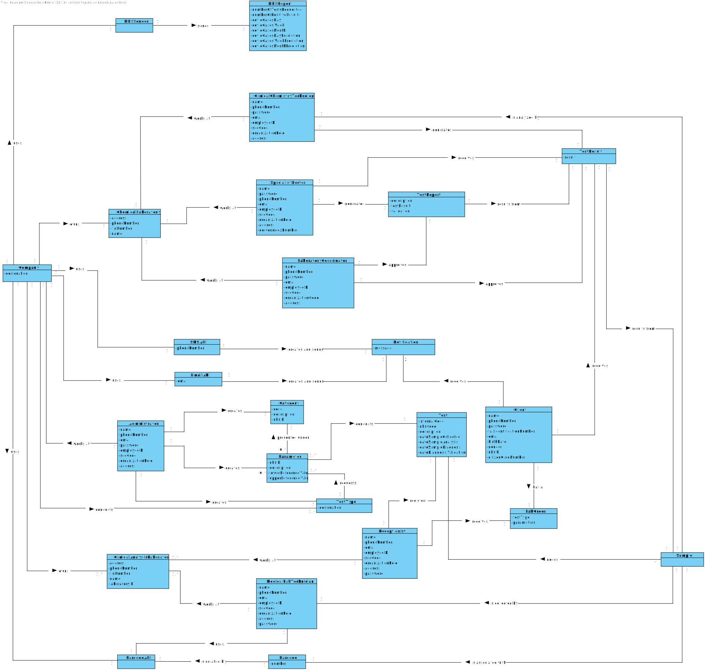

# OO Analysis 

### _Conceptual Class Category List_ ###

**Business Transactions**

* Test  

---

**Transaction Line Items**

* Sample    
* TestReport  

---

**Product/Service related to a Transaction or Transaction Line Item**

* Parameter  
* TestResult  
* Test   
* LabOrder  

---

**Transaction Records**

---  

**Roles of People or Organizations**

* Administrator    
* Client  
* Receptionist    
* Specialist Doctor    
* ChemicalChemistryTechnologist  
* LaboratoryCoordinator    
* MedicalLabTechnician  

---

**Places**

* ClinicalAnalysisLaboratory    
* ChemicalLaboratory   

---

**Noteworthy Events**
    
* Notification  

---

**Physical Objects**

* Sample
* LabOrder  

---

**Descriptions of Things**

* Company
* Category  
* TestType
* LabOrder
* TestReport

---

**Catalogs**
 
---

**Containers**
    
---  

**Elements of Containers**
   
---

**Organizations**

* Company  

---

**Other External/Collaborating Systems**

* BarcodeAPI  
* NHSSender
* EmailAPI  
* SMSAPI    

---

**Records of finance, work, contracts, legal matters**

* TestReport
* NHSReport     

---

**Financial Instruments** 

---

**Documents mentioned/used to perform some work/**

* TestResult  
* TestReport
* NHSReport  
* LabOrder

---

### **Concepts Associations** ###
  
| Concept (A) 		         |  Association   	   |  Concept (B)      				 	 |   
|:------------------------|:-----------------|:--------------------------------------------------|  
|	**_Administrator_**          |	creates                 |	**_Category_**				         |
|	**_Administrator_**          |	creates                 |	**_TestType_**				         |
|	**_Administrator_**          |	creates                 |	**_Parameter_**				         |
|	**_Administrator_**			 |  works at                |   **_Company_**                        |
|   **_Barcode_**                |  is created by           |   **_BarcodeAPI_**                     |
|    **_Client_**                |   has a                   |   **_LabOrder_**                       |
|	**_Client_**                 |	receives                |	**_Notification_**       			 |
|	**_Client_**                 |	receives                |	**_TestResult_**  		             |
|	**_Client_**                 |	requests                |	**_Test_**       				     |
|   **_ClinicalChemistryTechnologist_** |  generates        |   **_TestResult_**                     |
|	**_ClinicalChemistryTechnologist_** |  works at         |   **_ChemicalLaboratory_**             |
|	**_Company_**                |	conducts                |	**_TestType_**    				     |
|	**_Company_**                |	owns                    |	**_ClinicalAnalysislaboratory_**     |
|	**_Company_**                |	owns                    |	**_ChemicalLaboratory_**		     |
|   **_Company_**                |  uses                    |   **_BarcodeAPI_**                     |
|   **_Company_**                |  uses                    |   **_EmailAPI_**                       |
|   **_Company_**                |  uses                    |   **_NHSSender_**                      |
|   **_Company_**                |  uses                    |   **_SMSAPI_**                         |
|   **_EmailAPI_**               |  creates and sends       |   **_Notification_**                   |
|	**_LaboratoryCoordinator_**  |	approves                |   **_TestReport_**                     |
|	**_LaboratoryCoordinator_**  |	approves                |   **_TestResult_**                     |
|	**_LaboratoryCoordinator_**  |	works at                |   **_ChemicalLaboratory_**             |
|	**_MedicalLabTechnician_**   |	works at                |	**_ClinicalAnalysisLaboratory_**     |
|	**_MedicalLabTechnician_**   |	uses                    |	**_BarcodeAPI_**                     |
|	**_NHSSender_**		         |	sends		            |   **_NHSReport_**			             |
|	**_Parameter_**              |	conducts                |	**_Test_**    				         |
|	**_Parameter_**           	 |	is presented under a    |	**_Category_**     				     |
|	**_Receptionist_**			 |	works at			    |	**_ClinicalAnalysisLaboratory_**     |
|   **_Receptionist_**	         |   receives                   |   **_LabOrder_**                       |
|	**_Receptionist_**			 |	registers			    |	**_Test_**                           |
|   **_Sample_**				 |	is analysed by	        |   **_ClinicalChemistryTechnologist_**  |
|	**_Sample_**				 |	is associated with      |	**_Barcode_**					     |
|	**_Sample_**                 |	is collected by         |	**_MedicalLabTechnician_**		     |
|	**_Sample_**                 |	needs                   |	**_Test_**       				     |
|   **_SMSAPI_**                 |  creates and sends       |   **_Notification_**                   |
|	**_TestReport_**			 |	results from		    |	**_TestResult_**				     |
|	**_TestResult_**             |	results from            |   **_Sample_**						 |
|	**_TestType_**			     |	requests		        |	**_Parameter_**				         |
|	**_SpecialistDoctor_**	     |	generates			    |	**_TestReport_**				     | 
|	**_SpecialistDoctor_**	     |	receives			    |	**_TestResult_**					 |
|	**_SpecialistDoctor_**	     |	works at		        |	**_ChemicalLaboratory_**		     |

 

### **Concepts Attributes** ###

| Concepts | Attributes  |   
|:---------|:-----------|  
| **_Administrator_** | name, phoneNumber, email, password, employeeID, socCode, organizationRole, address. |
| **_Barcode_** | number. |
| **_BarcodeAPI_** | . | 
| **_Category_** | code, description, nhsID. |
| **_ChemicalLaboratory_** | address, phoneNumber, tinNumber, name. |
| **_Client_** | name, phoneNumber, password, taxIdentificationNumber, email, birthDate, gender, nhsID, citizenCardNumber. |
| **_ClinicalAnalysisLaboratory_** | address, phoneNumber, tinNumber, name, laboratoryID. |
| **_ClinicalChemistryTechnologist_** | name, phoneNumber, password, email, employeeID, socCode, organizationRole, address. |
| **_Company_** | designation. |
| **_EmailAPI_** | email. |
| **_LabOrder_** | testType, parameters. |
| **_LaboratoryCoordinator_** | name, password, phoneNumber, email, employeeID, socCode, organizationCode, address. |
| **_MedicalLabTechnician_** | name, phoneNumber, email, employeeID, socCode, organizationRole, address, password. |
| **_NHSReport_** | numberOfTestsRequested, numberOfPositiveResults, covidCasesDay, covidCasesWeek, covidCasesMonth, covidCasesDayPrediction, covidCasesWeekPrediction, covidCasesMonthPrediction. |
| **_NHSSender_** | . | 
| **_Notification_** | message. |
| **_Parameter_** | nhsID, description, lowerReferenceValue, upperReferenceValue. |
| **_Receptionist_** | name, phoneNumber, email, password, employeeID, socCode, organizationRole, address. |
| **_Sample_** | . |
| **_SMSSAPI_** | phoneNumber. | 
| **_SpecialistDoctor_** | name, password, phoneNumber, email, employeeID, socCode, organizationRole, address, doctorIndexNumber. |
| **_Test_** | internalCode, nhsCode, description, dateSampleCollected, dateSampleAnalysis, dateSampleDiagnosis, dateDiagnosisValidation. |
| **_TestReport_** | description, testResult, validation. |
| **_TestResult_** | result. |
| **_TestType_**| designation. |

## Domain Model

