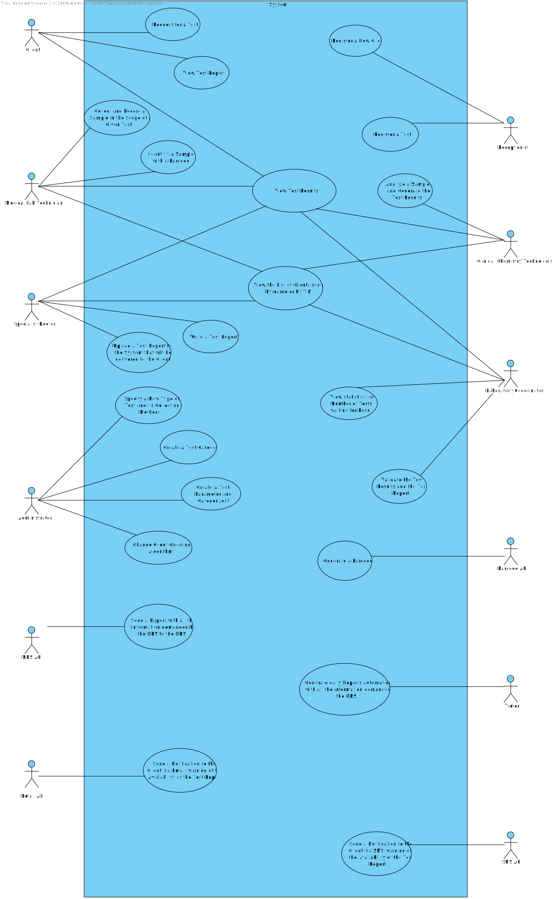

# Use Case Diagram (UCD)

# Use Cases / User Stories
| UC/US  | Description                                                               |                   
|:----|:------------------------------------------------------------------------|
| US1 | [As a Client, I intend to request a test.](US1.md)|
| US2 | [As a Client, I intend to view the test report. ](US2.md)|
| US3 | [As a Client, I intend to view the test results. ](US3.md)|
| US4 | [As a Receptionist, I intend to register a new client in the system. ](US4.md)   |
| US5 | [As a Receptionist, I intend to register a test in the system. ](US5.md)  |
| US6 | [As a Medical Lab Technician, I want to collect and record a sample in the scope of a given test. ](US6.md)|
| US7 | [As a Medical Lab Technician, I want to identify a sample with a barcode. ](US7.md)|
| US8 | [As a Medical Lab Technician, I want to view the test results of the client. ](US8.md)|
| US9 | [As a Medical Lab Technician, I want to view the list of clients sorted by name or by TIN. ](US9.md)|
| US10 | [As a Clinical Chemistry Technologist, I want to analyze a sample and generate the test results. ](US10.md)|
| US11 | [As a Clinical Chemistry Technologist, I want to view the test results of the client. ](US11.md)|
| US12 | [As a Clinical Chemistry Technologist, I want to view the list of clients sorted by name or by TIN. ](US12.md)|
| US13 | [As a Specialist Doctor, I want to write a test report. ](US13.md)|
| US14 | [As a Specialist Doctor, I want to upload a test report to the system that will be delivered to the client. ](US14.md)|
| US15 | [As a Specialist Doctor, I want to view the test results of the client. ](US15.md)|
| US16 | [As a Specialist Doctor, I want to view the list of clients sorted by name or by TIN. ](US16.md)|
| US17 | [As Laboratory Coordinator, I want to validate the test results and the test report. ](US17.md)|
| US18 | [As Laboratory Coordinator, I want to view statistics for the number of tests waiting for the result. ](US18.md)|
| US19 | [As Laboratory Coordinator, I want to view the test results of the client. ](US19.md)|
| US20 | [As Laboratory Coordinator, I want to view the list of clients sorted by name or by TIN. ](US20.md)|
| US21 | [As an Administrator, I want to specify a new type of test and its collecting methods. ](US21.md)|
| US22 | [As an Administrator, I want to create a test category. ](US22.md)|
| US23 | [As an Administrator, I want to create a test parameter and categorize it. ](US23.md)|
| US24 | [As an Administrator, I want to change the client ordering algorithm through a configuration file. ](US24.md)|
| US25 | [As a Barcode API, I want to generate a barcode. ](US25.md)|
| US26 | [As a NHS API, I want to send a report with all the information demanded by the NHS to the NHS. ](US26.md)|
| US27 | [As a Timer, I want to generate daily reports automatically with all the information demanded by the NHS. ](US27.md)|
| US28 | [As a Email API, I want to send a notification to the client via email warning of the availability of the test report. ](US28.md)|
| US29 | [As a SMS API, I want to send a notification to the client via SMS warning of the availability of the test report. ](US29.md)|

