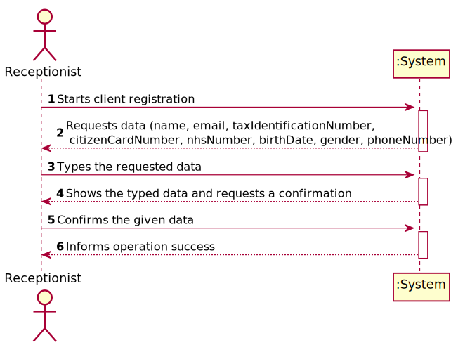
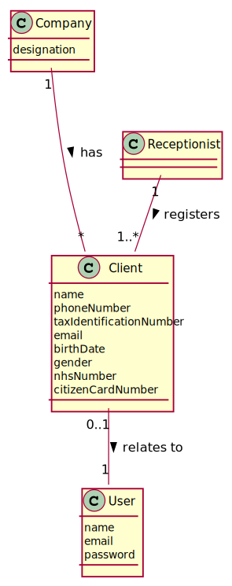
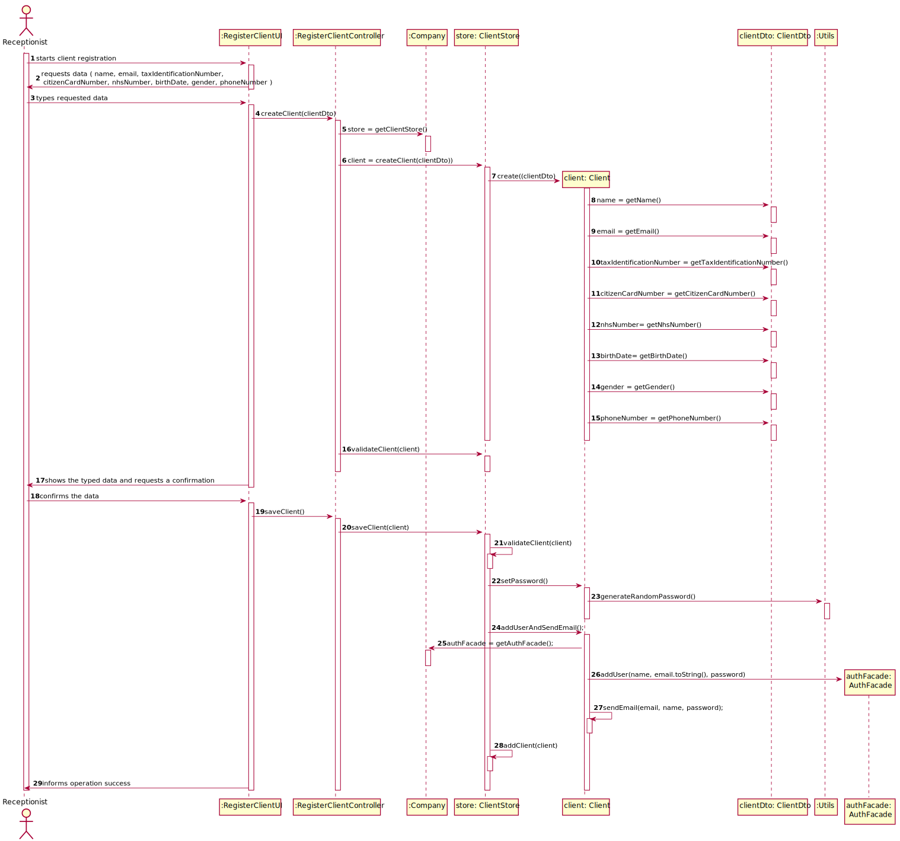
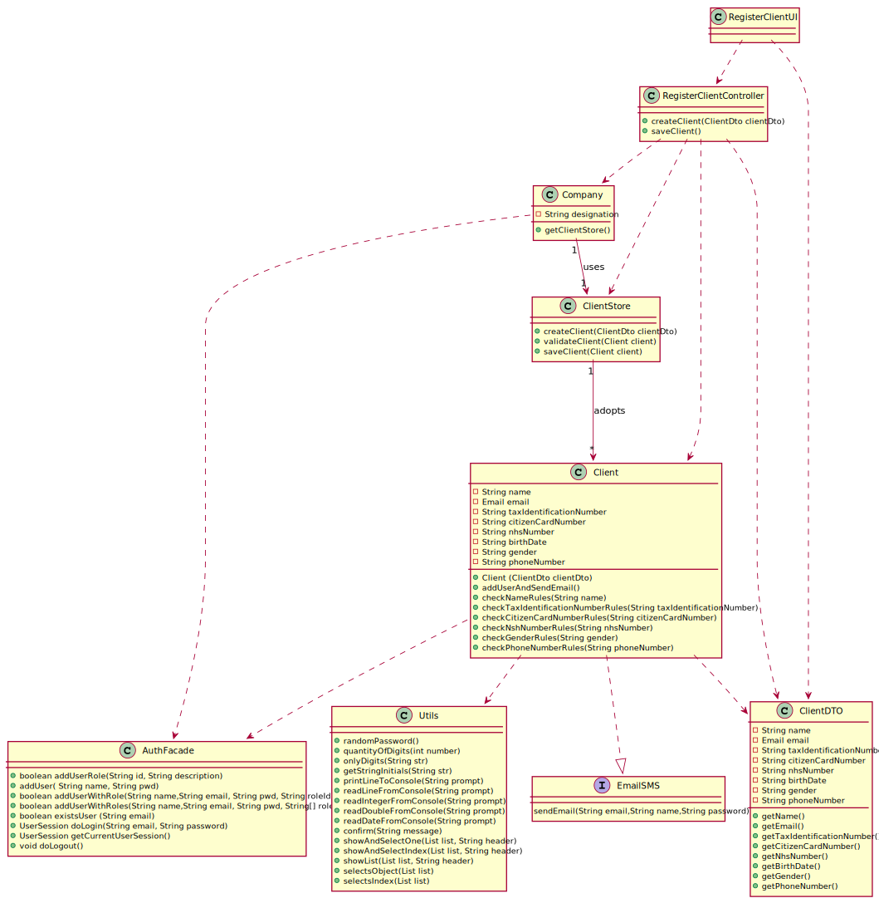

# US 003 - Register Client

# US 003 - Register Client

## 1. Requirements Engineering

### 1.1. User Story Description

As a **receptionist** of the laboratory, I want to register a **client**

### 1.2. Customer Specifications and Clarifications 

**From the specifications document:**

>   * " In case of a new client, the receptionist registers the client in the application. To register a client, the
      receptionist needs the client’s **citizen card number**, **National Healthcare Service (NHS) number**,
      **birth date**, **sex**, **Tax Identification number (TIF)**, **phone number**, **e-mail** and **name**. "
      
      
**From the client clarifications:**

>   * **Question:** The receptionist needs mandatorily of all client data described on the project description?
>                    To register a Client which is the format of each attribute? 
>     * **Answer:**
>         * Citizen Card: 16 digit number
>         * NHS: 10 digit number
>         * TIN: 10 digit number
>         * Birth day - in which format: DD/MM/YY
>         * Sex - should only be Male/Female or include more options. Male/Female.
>         * Phone number: 11 digit number
>         * The sex is opcional. All other fields are required.
>         
>   * **Question:** During the registration of a customer, if he gives a phone number already used by
>                    another customer, should the registration continue normally or should it be canceled?
>
>     * **Answer:** From a previous post: "The e-mail address and phone number should be unique for each user". The system should present a message informing about the error and asking for a different phone number.
>
>   * **Question:** What should be the maximum length of the String with the name of the Client?
>
>     * **Answer:** A string with no more than 35 characters. 
>
>   * **Question:** Does the receptionist need to be logged in to the app to perform the registration?
>
>     * **Answer:** Yes.
>
>   * **Question:** What parameter (asked by the receptionist)
>                    should the system use to create the password of the new client?
>
>     * **Answer:** The password should be randomly generated. It should have ten alphanumeric characters.
>
>   * **Question:** Recently you said that the maximum acceptable age is 150 years old, so the client can be born in 1870 and the data format is DD/MM/YY, this format can be tricky because, for example, if the data is DD/MM/70 the data can indicate that he born on 1870 or 1970.
>                   How can we solve this? Or I am understanding wrong?
>
>     * **Answer:** Thank you for identifying this issue. Please consider DD / MM / YYYY format for all dates.

### 1.3. Acceptance Criteria

* **AC1:**  Citizen Card number must have 16 digits.
* **AC2:**  NHS number must have 10 digits.
* **AC3:**  TIN must have 10 digits.
* **AC4:**  Birth day must be in DD/MM/YYYY format.
* **AC5:**  Gender must be Male or Female.
* **AC6:**  Phone number must have 11 digits.
* **AC7:**  The Gender is not mandatory.
* **AC8:** The client must become a system user.
           The "auth" component available on the repository must be reused (without modifications).
* **AC9:** Password must have 10 alphanumeric characters.
* **AC10:** Password must include three capital letters and two digits.
* **AC11:** Name must have a maximum of 35 characters.
* **AC12:** The Phone number must be unique for each Client.
* **AC13:** The Email must be unique for each Client.

### 1.4. Found out Dependencies

* There is a dependency with "US07 As an administrator, I want to register a new employee" because the receptionist needs to be registered in the
  system to register a client.
  
### 1.5 Input and Output Data
**Input Data:**

* Typed data:
    *  a Name, 
    *  a E-mail,
	*  a Citizen Card number, 
	*  a NHS number,
	*  a TIN number,
	*  a Birth date,
	*  a Gender,
	*  a Phone number
	
* Selected data: (none)
   
	

**Output Data:**

* (In)Success of client registration operation  

### 1.6. System Sequence Diagram (SSD)

*Insert here a SSD depicting the envisioned Actor-System interactions and throughout which data is inputted and outputted to fulfill the requirement. All interactions must be numbered.*

### 1.7 Other Relevant Remarks

* This function must be available when the receptionist needs to register a client 

## 2. OO Analysis

### 2.1. Relevant Domain Model Excerpt 
*In this section, it is suggested to present an excerpt of the domain model that is seen as relevant to fulfill this requirement.* 

### 2.2. Other Remarks

* N/A

## 3. Design - User Story Realization 

### 3.1. Rationale

**The rationale grounds on the SSD interactions and the identified input/output data.**

| Interaction ID | Question: Which class is responsible for... | Answer  | Justification (with patterns)  |
|:-------------  |:--------------------- |:------------|:---------------------------- |
| Step 1: Starts client registration  		 |	... interacting with the actor? | RegisterClientUI  |  Pure Fabrication: there is no reason to assign this responsibility to any existing class in the Domain Model. |
| 			  		 |	... coordinating the US? | RegisterClientController | Controller.                             |
| 			  		 |	... instantiating a new Client? | ClientStore  | Creates all the Clients.   |
| Step 2: Requests data (name, email, taxIdentificationNumber, citizenCardNumber, nhsNumber, birthDate, gender, phoneNumber) . 		 |	... requesting the data?						 |      RegisterClientUI       |  IE: Is responsible for user interactions.                            |
| Step 3: Types the requested data 		 |	... typing the data? | Receptionist| IE: is responsible for typing all data.  |
| 			  		                 |	... saving the typed data? | ClientStore | IE: knows all the data.                             |
|                                    | ... maintaining the store? | Company | Maintains all the Stores. |
| Step 4: Shows the data and requests a confirmation. |... for showing the data?| ClientStore | IE: is responsible for all data.  | 
| Step 5: Confirms the given data. |   ... validating all data (local validation)? | Client | IE: owns its data. |
| 			  		                |   ... validating all data (global validation)? | ClientStore | IE: knows all the Client objects. | 
| 			  		                |   ... saving the created task? | ClientStore | IE: adopts/records all Client objects . | 
| Step 8: Informs operation success. |	... informing operation success? | RegisterClientUI  | IE: is responsible for user interactions.  |

### Systematization ##

According to the taken rationale, the conceptual classes promoted to software classes are: 

 * Client
 * Company

Other software classes (i.e. Pure Fabrication) identified: 

 * RegisterClientUI  
 * RegisterClientController
 * ClientStore
 

## 3.2. Sequence Diagram (SD)

*In this section, it is suggested to present an UML dynamic view stating the sequence of domain related software objects' interactions that allows to fulfill the requirement.* 

## 3.3. Class Diagram (CD)

*In this section, it is suggested to present an UML static view representing the main domain related software classes that are involved in fulfilling the requirement as well as and their relations, attributes and methods.*

# 4. Tests 
*In this section, it is suggested to systematize how the tests were designed to allow a correct measurement of requirements fulfilling.* 

**_DO NOT COPY ALL DEVELOPED TESTS HERE_**

**Test 1:** Check that it is not possible to create an instance of the Client with null values. 

	   @Test(expected = NullPointerException.class)
        public void clientNull(){
            Client client = new Client(null);
	    }

**Section 1:** Check that is not possible to create an instance of the Client with the name in the wrong format - AC11.

	   @Test
        public void checkNameRulesSuccess35chars() {
            ClientDto clientDto = new ClientDto("abcdefghijklmnopqrstuvwxyzPedroGege", new Email("pedro@gmail.com"), "1234567890", "1234567890123456", "1234567890", "11/09/2002", "Male", "91337755612");
            Client client = new Client(clientDto);
    
            assertTrue(true);
        }
    
        @Test(expected = IllegalArgumentException.class)
        public void checkNameRulesBlank() {
            ClientDto clientDto = new ClientDto("", new Email("pedro@gmail.com"), "1234567890", "1234567890123456", "1234567890", "11/09/2002", "Male", "91337755612");
            Client client = new Client(clientDto);
        }
        
**Section 2:** Check that is not possible to create an instance of the Client with the Tax Identification Number in the wrong format - AC3.

        @Test(expected = IllegalArgumentException.class)
        public void checkTaxIdentificationRulesBlank() {
            ClientDto clientDto = new ClientDto("Pedro", new Email("pedro@gmail.com"), "", "1234567890123456", "1234567890", "11/09/2002", "Male", "91337755612");
            Client client = new Client(clientDto);
        }
        @Test(expected = IllegalArgumentException.class)
        public void checkTaxIdentificationRulesEquals0() {
            ClientDto clientDto = new ClientDto("Pedro", new Email("pedro@gmail.com"), "0", "1234567890123456", "1234567890", "11/09/2002", "Male", "91337755612");
            Client client = new Client(clientDto);
        }
    
        @Test(expected = IllegalArgumentException.class)
        public void checkTaxIdentificationRulesLessThan() {
            ClientDto clientDto = new ClientDto("Pedro", new Email("pedro@gmail.com"), "12345", "1234567890123456", "1234567890", "11/09/2002", "Male", "91337755612");
            Client client = new Client(clientDto);
        }
    
        @Test(expected = IllegalArgumentException.class)
        public void checkTaxIdentificationRulesGreater() {
            ClientDto clientDto = new ClientDto("Pedro", new Email("pedro@gmail.com"), "11234567890", "1234567890123456", "1234567890", "11/09/2002", "Male", "91337755612");
            Client client = new Client(clientDto);
        }
    
        @Test(expected = IllegalArgumentException.class)
        public void checkTaxIdentificationRulesNegative() {
            ClientDto clientDto = new ClientDto("Pedro", new Email("pedro@gmail.com"), "-1234567890", "1234567890123456", "1234567890", "11/09/2002", "Male", "91337755612");
            Client client = new Client(clientDto);
        }
        
**Section 3:** Check that is not possible to create an instance of the Client with the Citizen Card Number in the wrong format - AC1.

       @Test(expected = IllegalArgumentException.class)
        public void checkCitizenCardNumberRulesBlank() {
            ClientDto clientDto = new ClientDto("Pedro", new Email("pedro@gmail.com"), "1234567890", "", "1234567890", "11/09/2002", "Male", "91337755612");
            Client client = new Client(clientDto);
        }
   
       @Test(expected = IllegalArgumentException.class)
       public void checkCitizenCardNumberRulesEquas0() {
           ClientDto clientDto = new ClientDto("Pedro", new Email("pedro@gmail.com"), "1234567890", "0", "1234567890", "11/09/2002", "Male", "91337755612");
           Client client = new Client(clientDto);
       }
   
       @Test(expected = IllegalArgumentException.class)
       public void checkCitizenCardNumberRulesLessThan() {
           ClientDto clientDto = new ClientDto("Pedro", new Email("pedro@gmail.com"), "1234567890", "123456789012345", "1234567890", "11/09/2002", "Male", "91337755612");
           Client client = new Client(clientDto);
       }
   
       @Test(expected = IllegalArgumentException.class)
       public void checkCitizenCardNumberRulesGreater() {
           ClientDto clientDto = new ClientDto("Pedro", new Email("pedro@gmail.com"), "1234567890", "12345678901234561", "1234567890", "11/09/2002", "Male", "91337755612");
           Client client = new Client(clientDto);
       }
   
       @Test(expected = IllegalArgumentException.class)
       public void checkCitizenCardNumberRulesNegative() {
           ClientDto clientDto = new ClientDto("Pedro", new Email("pedro@gmail.com"), "1234567890", "-12345678901234561", "1234567890", "11/09/2002", "Male", "91337755612");
           Client client = new Client(clientDto);
       }
       
**Section 4:** Check that is not possible to create an instance of the Client with the National Healthcare Service Number in the wrong format - AC2.        
     
      @Test(expected = IllegalArgumentException.class)
      public void checkNhsNumberRulesBlank() {
           ClientDto clientDto = new ClientDto("Pedro", new Email("pedro@gmail.com"), "1234567890", "1234567890123456", "", "11/09/2002", "Male", "91337755612");
           Client client = new Client(clientDto);
      }
      @Test(expected = IllegalArgumentException.class)
      public void checkNhsNumberRulesEquals() {
          ClientDto clientDto = new ClientDto("Pedro", new Email("pedro@gmail.com"), "1234567890", "1234567890123456", "0", "11/09/2002", "Male", "91337755612");
          Client client = new Client(clientDto);
      }
     
      @Test(expected = IllegalArgumentException.class)
      public void checkNhsNumberRulesLessThan() {
          ClientDto clientDto = new ClientDto("Pedro", new Email("pedro@gmail.com"), "1234567890", "1234567890123456", "234567890", "11/09/2002", "Male", "91337755612");
          Client client = new Client(clientDto);
      }
     
      @Test(expected = IllegalArgumentException.class)
      public void checkNhsNumberRulesGreater() {
          ClientDto clientDto = new ClientDto("Pedro", new Email("pedro@gmail.com"), "1234567890", "1234567890123456", "12345678901", "11/09/2002", "Male", "91337755612");
          Client client = new Client(clientDto);
      }
     
      @Test(expected = IllegalArgumentException.class)
      public void checkNhsNumberRulesNegative() {
          ClientDto clientDto = new ClientDto("Pedro", new Email("pedro@gmail.com"), "1234567890", "1234567890123456", "-1234567890", "11/09/2002", "Male", "91337755612");
          Client client = new Client(clientDto);
      }
          
**Section 5:** Check that is not possible to create an instance of the Client with the Gender in the wrong format - AC7, AC9.   
      
      @Test(expected = IllegalArgumentException.class)
      public void checkGenderRulesError() {
           ClientDto clientDto = new ClientDto("Pedro", new Email("pedro@gmail.com"), "1234567890", "1234567890123456", "1234567890", "11/09/2002", "No", "91337755612");
           Client client = new Client(clientDto);
      }

**Section 6:** Check that is not possible to create an instance of the Client with the Phone Number in the wrong format - AC6, AC12.

      @Test(expected = IllegalArgumentException.class)
      public void checkPhoneNumberRulesBlank() {
           ClientDto clientDto = new ClientDto("Pedro", new Email("pedro@gmail.com"), "1234567890", "1234567890123456", "1234567890", "11/09/2002", "Male", "");
           Client client = new Client(clientDto);
      }
      
      @Test(expected = IllegalArgumentException.class)
      public void checkNhsNumberRulesEquals0() {
           ClientDto clientDto = new ClientDto("Pedro", new Email("pedro@gmail.com"), "1234567890", "1234567890123456", "1234567890", "11/09/2002", "Male", "0");
           Client client = new Client(clientDto);
       }
      
      @Test(expected = IllegalArgumentException.class)
      public void checkPhoneNumberRulesLessThan() {
           ClientDto clientDto = new ClientDto("Pedro", new Email("pedro@gmail.com"), "1234567890", "1234567890123456", "1234567890", "11/09/2002", "Male", "913377556");
           Client client = new Client(clientDto);
          }
      @Test(expected = IllegalArgumentException.class)
      public void checkPhoneNumberRulesGreater() {
           ClientDto clientDto = new ClientDto("Pedro", new Email("pedro@gmail.com"), "1234567890", "1234567890123456", "1234567890", "11/09/2002", "Male", "9133775566666");
           Client client = new Client(clientDto);
      }
      
      @Test(expected = IllegalArgumentException.class)
      public void checkPhoneNumberRulesNegative() {
           ClientDto clientDto = new ClientDto("Pedro", new Email("pedro@gmail.com"), "1234567890", "1234567890123456", "1234567890", "11/09/2002", "Male", "-91337755612");
           Client client = new Client(clientDto);
      }
      
      @Test
          public void containsPhoneNumber() throws FileNotFoundException {
              ClientStore clientStore = new ClientStore();
              ClientDto clientDto = new ClientDto("Pedro", new Email("pedro@gmail.com"), "1234567890", "1234567890123456",
                      "1234567890", "11/09/2002", "Male", "91337755612");
              ClientDto clientDto1 = new ClientDto("Petro", new Email("petro@gmail.com"),"1234567890","1234567899999999","1234567899",
                      "11/09/2002","Male","91337755612");
              ClientDto clientDto2 = new ClientDto("Petro", new Email("pero@gmail.com"),"1234567890","1234567899999999","1234567899",
                      "11/09/2002","Male","91337755613");
              Client client = new Client(clientDto);
              Client client1 = new Client(clientDto1);
              Client client2 = new Client(clientDto2);
      
              clientStore.saveClient(client);
      
              boolean result = clientStore.containsPhoneNumber(client1.getPhoneNumber());
              boolean result1= clientStore.containsPhoneNumber(client2.getPhoneNumber());
      
      
              assertTrue(result);
              assertFalse(result1);
          }
             
*It is also recommended to organize this content by subsections.* 

# 5. Construction (Implementation)

*In this section, it is suggested to provide, if necessary, some evidence that the construction/implementation is in accordance with the previously carried out design. Furthermore, it is recommeded to mention/describe the existence of other relevant (e.g. configuration) files and highlight relevant commits.*

*It is also recommended to organize this content by subsections.* 

## Class RegisterClientController

     public boolean createClient(ClientDto clientDto) {
             identifyStore();
             this.client = this.store.createClient(clientDto);
             return this.store.validateClient(client);
     }
     
     private void identifyStore() {
         store = this.company.getClientStore();
     }
     
## Class Company

     public ClientStore getClientStore() {
         return this.clientStore;
     }    
     
## Class ClientStore

     public Client createClient(ClientDto clientDto) {
         return new Client(clientDto);
     }
     
     public boolean validateClient(Client client) {
         if (client == null)
             return false;
         return !this.clientList.contains(client);
     }
     
## Class Client

     public Client(ClientDto clientDto) {
         checkNameRules(clientDto.getName());
         checkTaxIdentificationNumberRules(clientDto.getTaxIdentificationNumber());
         checkCitizenCardNumberRules(clientDto.getCitizenCardNumber());
         checkNhsNumberRules(clientDto.getNhsNumber());
         checkPhoneNumberRules(clientDto.getPhoneNumber());
         checkGenderRules(clientDto.getGender());
         this.name = clientDto.getName();
         this.email = clientDto.getEmail();
         this.taxIdentificationNumber = clientDto.getTaxIdentificationNumber();
         this.citizenCardNumber = clientDto.getCitizenCardNumber();
         this.nhsNumber = clientDto.getNhsNumber();
         this.birthDate = clientDto.getBirthDate();
         this.phoneNumber = clientDto.getPhoneNumber();
         this.gender = clientDto.getGender();
     } 
              
## Class ClientDto

      public ClientDto(String name, Email email, String taxIdentificationNumber, String citizenCardNumber,
                            String nhsNumber, String birthDate, String gender, String phoneNumber) {
              this.name = name;
              this.email = email;
              this.taxIdentificationNumber = taxIdentificationNumber;
              this.citizenCardNumber = citizenCardNumber;
              this.nhsNumber = nhsNumber;
              this.birthDate = birthDate;
              this.gender = gender;
              this.phoneNumber = phoneNumber;
      }

# 6. Integration and Demo 

*In this section, it is suggested to describe the efforts made to integrate this functionality with the other features of the system.*

* There is a  Receptionist Menu, that can be accessed by all registered Receptionist, where there are all the options (User Stories) of the Receptionist.
* The option that allows to register a new Client (US-03), permits the Receptionist to create a new Client in the System. 
 
# 7. Observations

* With the work developed until now, is possible to register a new Client in the System. But, if then the Client wants to access the application won't be able to do nothing in the System, due to the fact that he haven´t a UI attributed to him.

