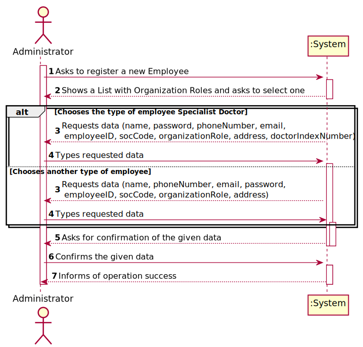
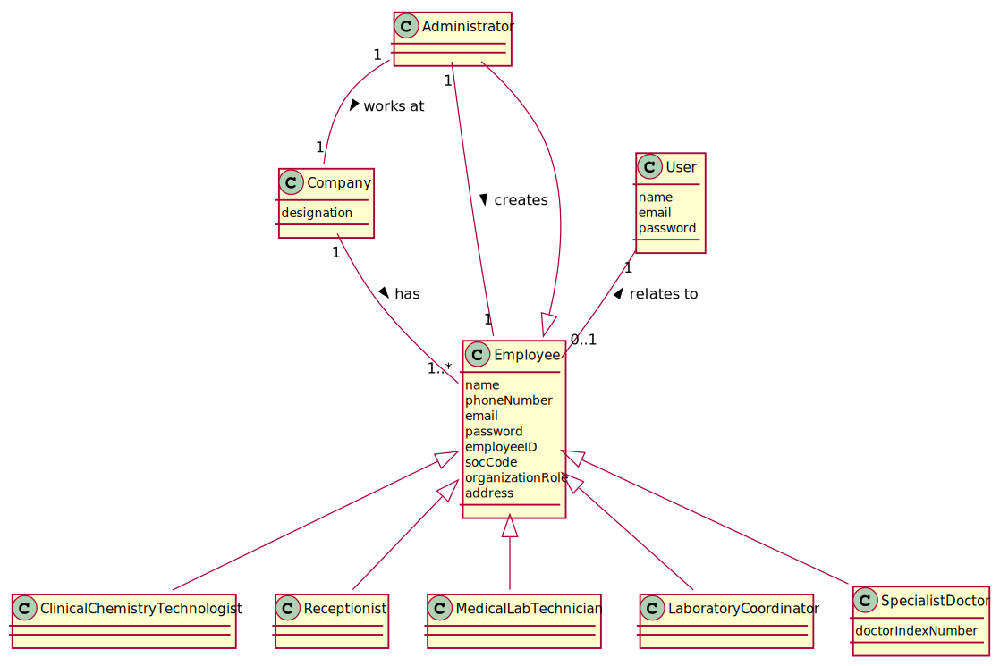
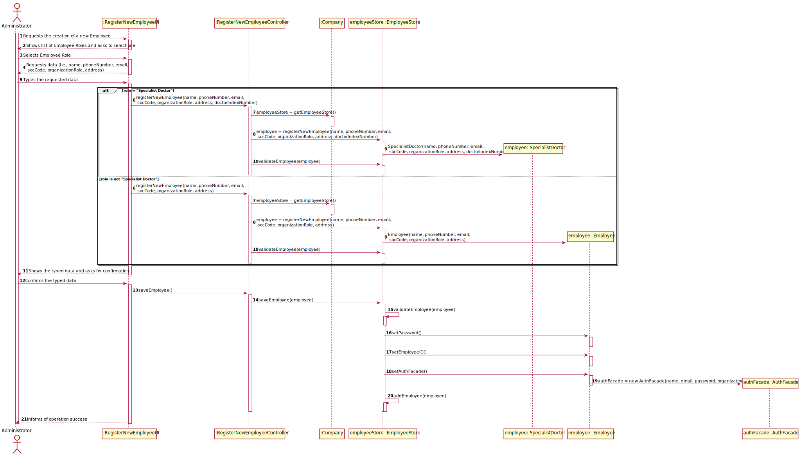
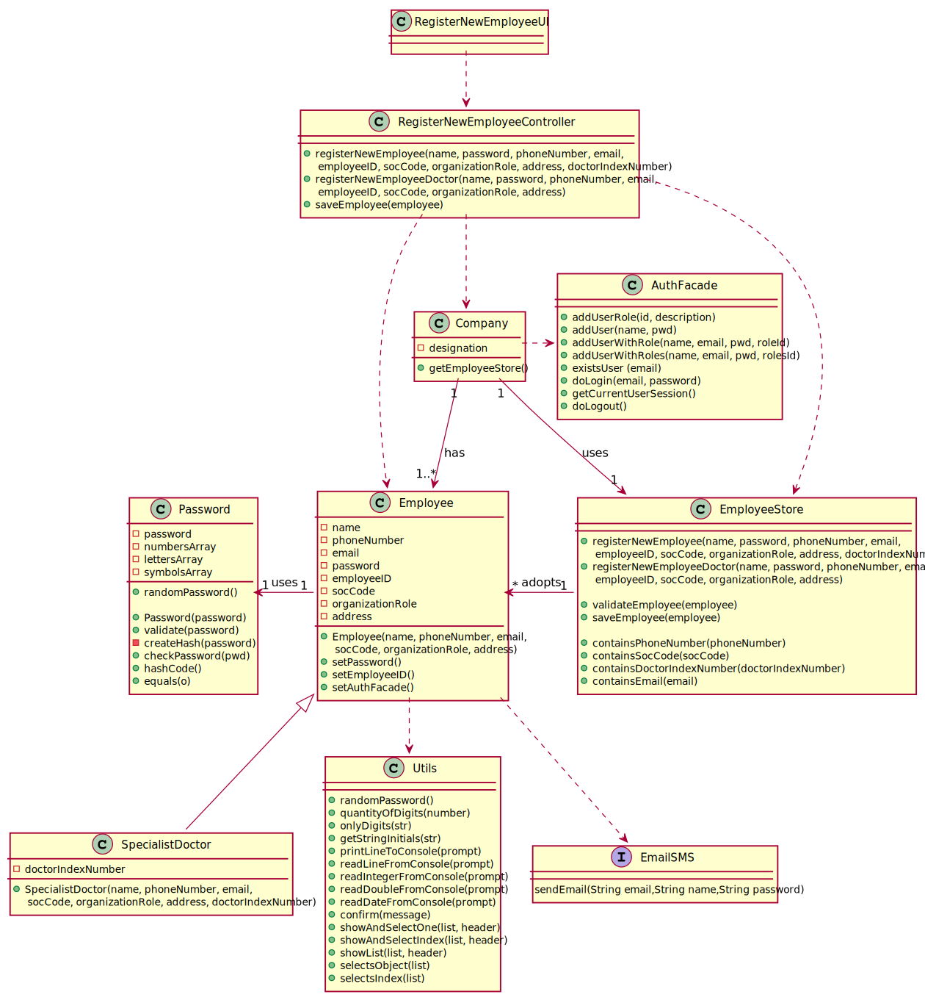

# US 007 - Register a new employee

## 1. Requirements Engineering

*In this section, it is suggested to capture the requirement description and specifications as provided by the client as well as any further clarification on it. It is also suggested to capture the requirements acceptance criteria and existing dependencies to other requirements. At last, identfy the involved input and output data and depicted an Actor-System interaction in order to fulfill the requirement.*
  
### 1.1. User Story Description

*As an administrator, I want to register a new employee.*

### 1.2. Customer Specifications and Clarifications 

- *Costumer specifications relative to Employee attributes:*

> All the roles that exist in the Many Labs company are characterized by the following attributes:
  Employee ID;
  Organization Role;
  Name;
  Address;
  Phone Number;
  E-Mail;
  Standard Occupational Classification (SOC) code.
  
> The Specialist Doctor has an additional attribute:
  Doctor Index Number.

> Whenever the Administrator selects to create a Specialist Doctor, the application should ask for the Doctor Index Number.

- *Costumer specifications relative to Employee attributes acceptance criteria:*

> Only the employee ID should be generated from the initials of the employee name and should include a number. The number has 5 digits and is increases automatically when a new employee is registered in the system. For instance, if the company has 20 employees and wants to register a specialist doctor having the name Ana Maria Santos Moura, then the employee ID for this specialist doctor should be AMSM00021.

> Q1: Is there any size limit to the employee's name?  
  A: I already answered this question. Employee Name: "a string with no more than 35 characters".
  
> Q2: Is there any validation that needs to be done on the employee's email format and size?  
  A: The format of an e-mail address is well known. Attribute validation is always a good practice.

> The password should be randomly generated. It should have ten alphanumeric characters.

> Q: When registering a new employee should the administrator write or select his role?  
  A: The administrator should write the role when he is registering a new employee.

> The roles are typed but should be valid roles that exist (are known) in the system.

### 1.3. Acceptance Criteria

- **AC1**: *Each user must have a single role defined in the system.*
- **AC2**: *Each user must have a password and an employee ID.*
- **AC3**: *Name, E-mail, Address, SOC code fields are obligatory.*
- **AC4**: *SOC code must have 4 digits.*
- **AC5**: *SOC code must only have numbers.*
- **AC6**: *Phone number must have 11 digits.*
- **AC7**: *Phone number must only have numbers.*
- **AC8**: *Employee ID is generated automatically.*
- **AC9**: *Password is generated automatically.*
- **AC10**: *Employee ID is generated by the Name initials and five digits, representative of the number of employees in the system (for example, ABCD00001).*
- **AC11**: *Password must have ten alphanumerical characters, with three capital letters and two digits.*
- **AC12**: *In case the Employee is a Specialist Doctor, the Doctor Index Number is obligatory.*
- **AC13**: *The Doctor Index Number must only have digits.*
- **AC14**: *The Doctor Index Number must have 6 digits.*

### 1.4. Found out Dependencies

- *N/A*

### 1.5 Input and Output Data

*The System will receive data depending on the type of employee to be created:*

***1. To create a Specialist Doctor:***

- name;
- phoneNumber;
- email; 
- socCode;
- address;
- doctorIndexNumber.

***2. To create another type of Employee:***

- name;
- phoneNumber;
- email; 
- socCode;
- address.

### 1.6. System Sequence Diagram (SSD)

### 1.7 Other Relevant Remarks

*This function will be used very often at the start of the Application, because there are no Employees registered to the System (there is only the first Administrator).*

## 2. OO Analysis

### 2.1. Relevant Domain Model Excerpt 

### 2.2. Other Remarks

- **N/A**

## 3. Design - User Story Realization 

### 3.1. Rationale

**The rationale grounds on the SSD interactions and the identified input/output data.**

| Interaction ID | Question: Which class is responsible for... | Answer  | Justification (with patterns)  |
|:-------------  |:--------------------- |:------------|:---------------------------- |
| Step 1: Asks to register a new Employee | ... interacting with the actor? | RegisterNewEmployeeUI | Pure Fabrication: there is no reason to assign this responsibility to any existing class in the Domain Model. |
|  | ... coordinating the User Story? | RegisterNewEmployeeController | Controller |     
|  | ... instantiating a new Employee? | EmployeeStore | Responsible for creating all the Employees |     
| Step 2: Shows a List with Organization Roles and asks to select one | ... showing the List? | RegisterNewEmployeeUI | IE: Is responsible for all client interactions. |
| Step 3: Requests the data (i.e., name, phoneNumber, email, password, employeeID, socCode, organizationRole, address) | ... requesting the data? | RegisterNewEmployeeUI | IE: Is responsible for all client interactions. |
| Step 4: Types the requested data | ... saving the typed data? | EmployeeStore | IE: Knows all the data. |     
|  | ... allowing the data to be typed? | RegisterNewEmployeeUI | IE: It is responsible for all user interactions. |
| Step 5: Asks for confirmation of the given data | ... showing the data? | EmployeeStore | IE: is responsible for all data. |
| Step 6: Confirms the given data | ... validating all the data (local validation)? | Employee | IE: Owns its' data. |
|  | ... validating all data (global validation)? | EmployeeStore | IE: Knows all the Employee objects. | 
| 			  		                |   ... saving the created task? | EmployeeStore | IE: Adopts/records all Employee objects . | 
| Step 7: Informs operation success |	... informing that the operation was a success? | RegisterNewEmployeeUI  | IE: It is responsible for all user interactions.  |

### Systematization ##

*According to the taken rationale, the conceptual classes promoted to software classes are:*

 * *Employee*
 * *Company*

*Other software classes (i.e. Pure Fabrication) identified:* 

 * *RegisterNewEmployeeUI*  
 * *RegisterNewEmployeeController*
 * *EmployeeStore*

## 3.2. Sequence Diagram (SD)

## 3.3. Class Diagram (CD)

# 4. Tests 

**_DO NOT COPY ALL DEVELOPED TESTS HERE_**

**Test 1:** Check that it is not possible to create an instance of the Example class with null values. 

	@Test(expected = IllegalArgumentException.class)
		public void ensureNullIsNotAllowed() {
		Exemplo instance = new Exemplo(null, null);
	}

*It is also recommended to organize this content by subsections.* 

# 5. Construction (Implementation)

*In this section, it is suggested to provide, if necessary, some evidence that the construction/implementation is in accordance with the previously carried out design. Furthermore, it is recommeded to mention/describe the existence of other relevant (e.g. configuration) files and highlight relevant commits.*

*It is also recommended to organize this content by subsections.* 

# 6. Integration and Demo 

*The Administrator Menu, that can be accessed by all registered Administrators, where there are all the options (User Stories) of an Administrator. The last option, the one that allows to register a new Employee (US-07), permits the Administrator to create a new Employee in the System. When this new Employee is created, depending on his role, he can have lots of options, for example:*

- **Receptionist**: *Able to register a new Client on the System.*
- **Administrator**: *Able to register a new Employee, a new Clinical Analysis Laboratory, a new Test Type, a new Parameter Category and a new Parameter.*
- **Specialist Doctor**: *At this moment, the Specialist Doctor is unable to run any type of options in the Application.*
- **Laboratory Coordinator**: *At this moment, the Laboratory Coordinator is unable to run any type of options in the Application.*
- **Chemical Analysis Technician**: *At this moment, the Chemical Analysis Technician is unable to run any type of options in the Application.*
- **Medical Laboratory Technician**: *At this moment, the Specialist Doctor is unable to run any type of options in the Application.*

# 7. Observations

*In this section, it is suggested to present a critical perspective on the developed work, pointing, for example, to other alternatives and or future related work.*
  
