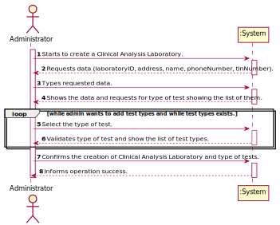

# US 008 - Register a new clinical analysis laboratory 

## 1. Requirements Engineering

*In this section, it is suggested to capture the requirement description and specifications as provided by the client as well as any further clarification on it. It is also suggested to capture the requirements acceptance criteria and existing dependencies to other requirements. At last, identfy the involved input and output data and depicted an Actor-System interaction in order to fulfill the requirement.*

### 1.1. User Story Description

*As an **administrator**, I want to register a new **clinical analysis laboratory** stating which
  kind of **test(s)** it operates*

### 1.2. Customer Specifications and Clarifications 

#### From the Specifications Document:
> "Many Labs is a company that operates in the English market, it has headquarters in London and has a network of clinical analysis laboratories in England where analysis of blood (samples ar collected) are performed, as well as Covid-19 tests.".
> "All Many Labs clinical analysis laboratories perform clinical blood tests, and a subset of these laboratories also performs Covid-19 tests.".

#### From the Client Specification:

* Question:
  Which type/format has LaboratoryID, address, name, phone number, and TIN number on Clinical Analysis Laboratory?
   * Answer:
     Each Clinical Analysis Laboratory is characterized by the following attributes:
     Laboratory ID: five alphanumeric characters;
     Name: A string with no more than 20 characters;
     Address: A string with no more than 30 characters;
     Phone Number: 11 digit number;
     TIN number: 10 digit number;
     
* Question:
  Does Chemical Laboratory have the same type/format of the attributes of Clinical Analysis Laboratory?
  * Answer: 
    For the Chemical Laboratory there is no need to specify the type of tests to be performed. 
    Other than this, the attributes and their type/format are the ones presented in my previous answer.

* Question: 
  Are the test types in US8 typed in or selected from those that the program has?
  * Answer: 
    The test types are selected from a list.
    
### 1.3. Acceptance Criteria

* AC1: laboratoryId should have five alphanumeric characters.
* AC2: adress should have a string with no more than 30 characters;
* AC3: name should have a string with no more than 20 characters.
* AC4: phoneNumber should have 11 digit numbers.
* AC5: taxIdentificationNumber should have 10 digit numbers.

### 1.4. Found out Dependencies

These US depends on US009 because this US needs Type of Test Store to say what types of tests does Clinical Analysis Laboratories use.*

### 1.5 Input and Output Data

**Input data:**

* Typed data: adress, name, phoneNumber, taxIdentificationNumber, description.
* Selected data: Test Types.

**Output data:**
* Success in registration of Clinical Analysis Laboratory together with the types of tests that will be provided.

### 1.6. System Sequence Diagram (SSD)

*Insert here a SSD depicting the envisioned Actor-System interactions and throughout which data is inputted and outputted to fulfill the requirement. All interactions must be numbered.*

### 1.7 Other Relevant Remarks

*The admin can create infinite Clinical Analysis Laboratories any time.*

## 2. OO Analysis

### 2.1. Relevant Domain Model Excerpt 
*In this section, it is suggested to present an excerpt of the domain model that is seen as relevant to fulfill this requirement.* 

### 2.2. Other Remarks

*  The creation of TestType is not an important association for that US, but needs to know that it exists.

## 3. Design - User Story Realization 

### 3.1. Rationale

**The rationale grounds on the SSD interactions and the identified input/output data.**

| Interaction ID | Question: Which class is responsible for... | Answer  | Justification (with patterns)  |
|:-------------  |:--------------------- |:------------|:---------------------------- |
| Step 1: Starts to create a Clinical Analysis Laboratory  		 |	... interacting with the actor? | CreateClinicalAnalysisLaboratoryUI  |  Pure Fabrication: there is no reason to assign this responsibility to any existing class in the Domain Model. |
| 			  		 |	... coordinating the US? | CreateClinicalAnalysisLaboratoryController | Controller.                             |
| 			  		 |	... instantiating a new ClinicalAnalysisLaboratory? | ClinicalAnalysisLaboratoryStore  | Creator (Rule 1): in the DM Organization has a Task.   |
| 			  		 |	... knowing to which organization the ClinicalAnalysisLaboratory belongs to? | Company  | IE: has registed all Organizations. |
| Step 2: Requests data (laboratoryID, address, name, phoneNumber, tinNumber).  		 |							 |             |                              |
| Step 3: Types requested data 		 |	... who can type the data? | Administrator  | IE: is responsible for all data.  |
| 			  		                 |	... saving the typed data? | ClinicalAnalysisLaboratoryStore | IE: knows all the data.                             |
| Step 4: Shows the data and requests for type of test showing the list of them. |... how can show the test type Store? | TestTypeDto | IE: is responsible for all data.  | 
| Step 5: Select the type of test.  		 |	... how save the selection? | ClinicalTestTypeStore |  IE: is responsible for all data. |
| Step 6: Validates type of test.   | ... knowing the type os tests to show? | TestTypeList | IE: knows all the data. |
| Step 7: Confirms the creation of Clinical Analysis Laboratory and type of tests. |   ... validating all data (local validation)? | TestTypeList | IE: owns its data. |
| 			  		                |   ... validating all data (global validation)? | Administrator | IE: knows all its tasks. | 
| 			  		                |   ... saving the created task? | Company | IE: owns all its tasks. | 
| Step 8: Informs operation success. |	... informing operation success? | CreateClinicalAnalysisLaboratoryUI  | IE: is responsible for user interactions.  |

### Systematization ##

According to the taken rationale, the conceptual classes promoted to software classes are: 

 * Administrator
 * ClinicalAnalysisLaboratory
 * Company
 * TestType

Other software classes (i.e. Pure Fabrication) identified:
 * CreateClinicalAnalysisLaboratoryUI
 * CreateClinicalAnalysisLaboratoryController
 * TestTypeStore
 * ClinicalAnalysisLaboratoryStore
 * ClinicalTestTypeList
 * TestTypeDto
 * TesTypeMapper

## 3.2. Sequence Diagram (SD)

*In this section, it is suggested to present an UML dynamic view stating the sequence of domain related software objects' interactions that allows to fulfill the requirement.* 

## 3.3. Class Diagram (CD)

*In this section, it is suggested to present an UML static view representing the main domain related software classes that are involved in fulfilling the requirement as well as and their relations, attributes and methods.*

# 4. Tests 
*In this section, it is suggested to systematize how the tests were designed to allow a correct measurement of requirements fulfilling.* 

**_DO NOT COPY ALL DEVELOPED TESTS HERE_**

**Without writing:**

**Test 1:** Check that it is not possible to create an instance of Clinical Analysis Laboratory class without typing 
one character in Laboratory Id parameter.

	 @Test (expected = IllegalArgumentException.class)
    public void checkLaboratoryIdRulesBlank() {
        ClinicalAnalysisLaboratory c= new ClinicalAnalysisLaboratory("","Rua","Miguel",
                "12345678912","1234567891");
    }
**Test 2:** Have the same mindset as Test 1 but for the parameter Address.

    @Test (expected = IllegalArgumentException.class)
    public void checkAddressRulesBlank() {
    ClinicalAnalysisLaboratory c= new ClinicalAnalysisLaboratory("12345","","Miguel",
    "12345678912","1234567891");
    }

This type of test is done for all parameters.

**Correct parameter:**

**Test 3:** Check that it is possible to create an instance of Clinical Analysis Laboratory class writing the 
Laboratory Id with correct values.

    @Test
    public void checkLaboratoryIdRulesRight() {
    ClinicalAnalysisLaboratory c= new ClinicalAnalysisLaboratory("12345","Rua","Miguel",
    "12345678912","1234567891");
    Assert.assertTrue(true);
    }

**Test 4:** Check that it is possible to create an instance of Clinical Analysis Laboratory class writing the
Name with correct values.

    @Test
    public void checkNameRulesEqual() {
    ClinicalAnalysisLaboratory c = new ClinicalAnalysisLaboratory("12345", "Rua",
    "MiguelMiguelMiguelMiguelMiguel", "12345678912",
    "1234567891");
    Assert.assertTrue(true);
    }

This type of test is done for all parameters.

**Acceptance Criteria Rules:**

**Test 5:** Check that it is not possible to create an instance of Clinical Analysis Laboratory class writing the
Laboratory Id with excess characters.

    @Test (expected = IllegalArgumentException.class)
    public void checkLaboratoryIdRulesUp() {
        ClinicalAnalysisLaboratory c = new ClinicalAnalysisLaboratory("1234567", "Rua", "Miguel",
                "12345678912", "1234567891");
    }

**Test 6:** Check that it is not possible to create an instance of Clinical Analysis Laboratory class writing the
Laboratory Id with less characters.

    @Test (expected = IllegalArgumentException.class)
    public void checkLaboratoryIdRulesDown() {
        ClinicalAnalysisLaboratory c = new ClinicalAnalysisLaboratory("123", "Rua", "Miguel",
                "12345678912", "1234567891");
    }

**Test 7:** Check that it is not possible to create an instance of Clinical Analysis Laboratory class writing the
Phone Number with excess characters.

    @Test (expected = IllegalArgumentException.class)
    public void checkPhoneNumberRulesUp() {
        ClinicalAnalysisLaboratory c= new ClinicalAnalysisLaboratory("12345","Rua",
                "Miguel", "123456789123","1234567891");
    }

**Test 8:** Check that it is not possible to create an instance of Clinical Analysis Laboratory class writing the
Phone Number with less characters.

    @Test (expected = IllegalArgumentException.class)
    public void checkPhoneNumberRulesDown() {
        ClinicalAnalysisLaboratory c= new ClinicalAnalysisLaboratory("12345","Rua",
                "Miguel", "1234567891","1234567891");
    }

**Test 9:** Check that it is not possible to create an instance of Clinical Analysis Laboratory class writing the
TIN with excess characters.

    @Test (expected = IllegalArgumentException.class)
    public void checkTaxIdentificationNumberRulesUp() {
    ClinicalAnalysisLaboratory c= new ClinicalAnalysisLaboratory("12345","Rua",
    "Miguel", "12345678912","12345678912");
    }

**Test 10:** Check that it is not possible to create an instance of Clinical Analysis Laboratory class writing the
TIN with less characters.

    @Test (expected = IllegalArgumentException.class)
    public void checkTaxIdentificationNumberRulesDown() {
        ClinicalAnalysisLaboratory c= new ClinicalAnalysisLaboratory("12345","Rua",
                "Miguel", "12345678912","123456789");
    }

**Only Digits:**

**Test 11:** Check that it is not possible to create an instance of Clinical Analysis Laboratory class writing the
Phone Number with characters, this check if Phone Number have only digits.

    @Test (expected = IllegalArgumentException.class)
    public void checkPhoneNumberRulesOnlyDigits() {
    ClinicalAnalysisLaboratory c= new ClinicalAnalysisLaboratory("12345","Rua",
    "Miguel", "letras","1234567891");
    }

**Test 12:** Check that it is not possible to create an instance of Clinical Analysis Laboratory class writing the
TIN with characters, this check if TIN have only digits.

    @Test (expected = IllegalArgumentException.class)
    public void checkTaxIdentificationNumberRulesOnlyDigits() {
    ClinicalAnalysisLaboratory c= new ClinicalAnalysisLaboratory("12345","Rua",
    "Miguel", "12345678912","letras");
    }

*It is also recommended to organize this content by subsections.* 

# 5. Construction (Implementation)

*In this section, it is suggested to provide, if necessary, some evidence that the construction/implementation is in accordance with the previously carried out design. Furthermore, it is recommeded to mention/describe the existence of other relevant (e.g. configuration) files and highlight relevant commits.*

Note: This class is only presented with methods to show that this class is in accordance with Design.

public class CreateClinicalAnalysisLaboratoryController {

    private final Company company;

    private ClinicalAnalysisLaboratory lab;

    private ClinicalTestTypeList typeList;

    public CreateClinicalAnalysisLaboratoryController() {
        this(App.getInstance().getCompany());
    }

    public CreateClinicalAnalysisLaboratoryController(Company company) {
        this.company = company;
        this.lab = null;
        this.typeList = new ClinicalTestTypeList();
    }

    public boolean createClinicalAnalysisLaboratory(String laboratoryID, String address, String name, String phoneNumber,
                                                    String taxIdentificationNumber) {
        this.lab = this.company.getClinicalAnalysisLaboratoryStore().createClinicalAnalysisLaboratory(laboratoryID,
                address, name, phoneNumber, taxIdentificationNumber);
        return this.company.getClinicalAnalysisLaboratoryStore().validatesClinicalAnalysisLaboratory(lab);
    }

    public boolean saveClinicalAnalysisLaboratory() {
        if (this.company.getClinicalAnalysisLaboratoryStore().validatesClinicalAnalysisLaboratory(lab)) {
            return this.company.getClinicalAnalysisLaboratoryStore().saveClinicalAnalysisLaboratory(lab);
        }
        return false;
    }

    public ClinicalAnalysisLaboratory getClinicalAnalysisLaboratoryStore() {
        return lab;
    }

    public List<TestType> getTypeStore() {
        return this.company.getTestTypeStore().getTypeStore();
    }

    public List<TestTypeDto> listDto() {
        TestTypeMapper testTypeMapper = new TestTypeMapper();
        return testTypeMapper.listDTO(getTypeStore());
    }

    public TestType getTestTypeCode(int code) {
        return this.company.getTestTypeStore().getTestTypeByCode(code);
    }

    public boolean saveClinicalTestType(TestType testType) {
        return typeList.saveClinicalTestType(testType);
    }

    public boolean saveTestTypeListToClinicalAnalysisLaboratory() {
        return this.lab.saveTestTypeListToClinicalAnalysisLaboratory(typeList);
    }
    }

*It is also recommended to organize this content by subsections.* 

# 6. Integration and Demo 

*In this section, it is suggested to describe the efforts made to integrate this functionality with the other features of the system.*

This US requires knowledgeble about the US07, US10 and US11 a little bit because to produce that UI we need to have the 
Parameters, the ParameterCategories and the Test Types created to finally create the Clinical Analysis Laboratory. 
Only with that creation in order is that it possible to create and test if that UI is implemented correctly.

# 7. Observations

*In this section, it is suggested to present a critical perspective on the developed work, pointing, for example, to other alternatives and or future related work.*

