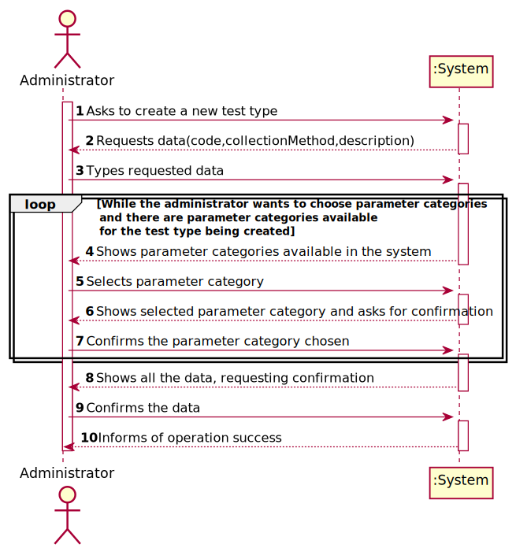
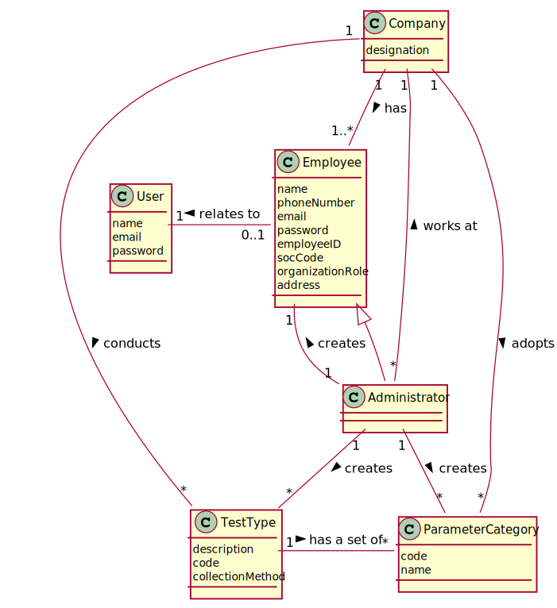
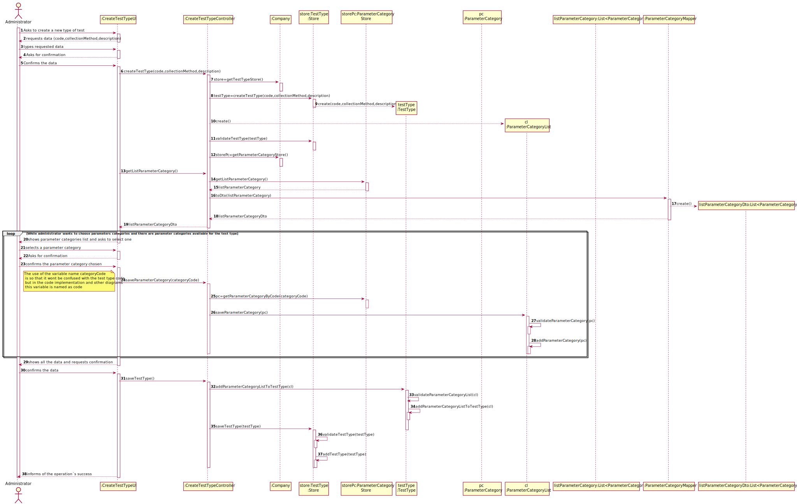
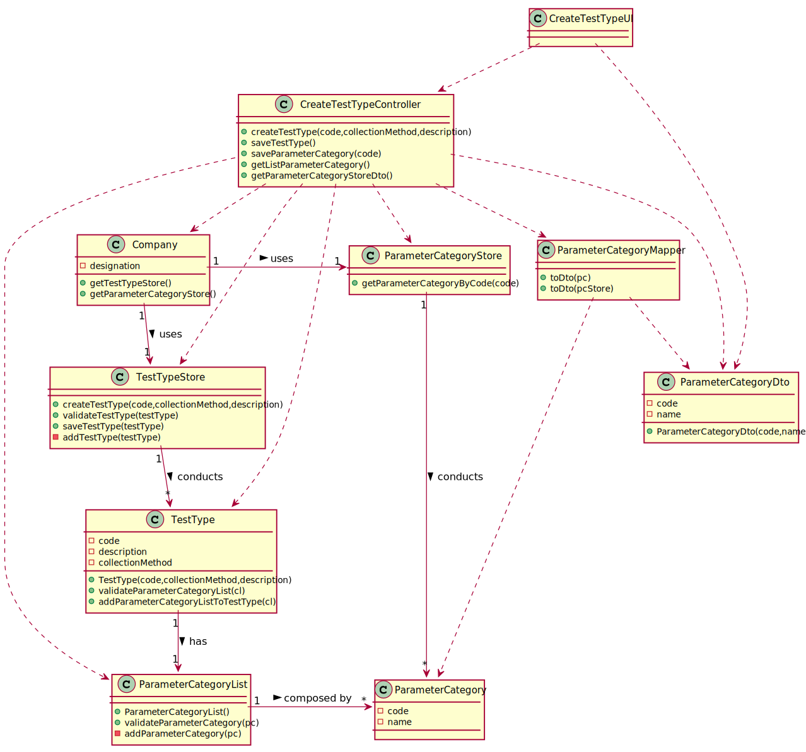

# US 009 - Specify new test type

## 1. Requirements Engineering

*In this section, it is suggested to capture the requirement description and specifications as provided by the client as well as any further clarification on it. It is also suggested capturing the requirement's acceptance criteria and existing dependencies to other requirements. At last, identify the involved input and output data and depicted an Actor-System interaction in order to fulfill the requirement.*

### 1.1. User Story Description

*As an administrator, I want to specify a new type of test and its collecting methods*

### 1.2. Customer Specifications and Clarifications 

>Despite being out of scope, the system should be developed having in mind the need to
easily support other kinds of tests (e.g., urine). Regardless, such tests rely on measuring one
or more parameters that can be grouped/organized by categories.

#### From the Client Specification:

>* **Question**: Does a type of test holds any attribute besides its name and collecting methods?  
   **Answer**: The attributes for a new test type are:  
   Code: five alphanumeric characters. The code is not automatically generated.
   Description: a string with no more than 15 characters.  
   Collecting Method: a string with no more than 20 characters.  
   Each test type should have a set of categories. Each category should be chosen from a list of categories.  
   From a previous post: "Each category has a name and a unique code. There are no subcategories."

> * **Question**: Can a type of test have more than one collection method?  
    **Answer**: There exists only one collection method per test type.  

 > * **Question**: In the US9 what do you mean by the collecting methods and  what collecting methods  are available?   
    **Answer**: To make a COVID-19 test you need a swab to collect a sample. To make a blood test you need sample tubes and a syringe.
    When the administrator (US9) specifies a new type of test, the administrator also specifies the method to collect a sample. The administrator introduces a brief description for each collecting method.

### 1.3. Acceptance Criteria

* **AC1:** The code should be composed by five alphanumeric characters.
* **AC2:**  The code should not be generated automatically.
* **AC3:** The description should be a string with no more than 15 characters.
* **AC4:** The collection method should be a string with no more than 20 characters.
* **AC5:** Each test type should have a set of parameter categories,with at least one parameter category inside.
* **AC6:** Each parameter category should be chosen from a list of categories.

### 1.4. Found out Dependencies

*There is a dependency to "US011 Create a ParameterCategory " since at least a parameterCategory must exist to classify it under the type of test being created.*

### 1.5 Input and Output Data

**Input Data:**

* Typed data:
  * description
  * collectionMethod
  * code

* Selected data:
  * chosen parameter categories
    
**Output Data:**

* List of existing parameter categories
* (In)Success of the operation

### 1.6. System Sequence Diagram (SSD)
*Insert here a SSD depicting the envisioned Actor-System interactions and throughout which data is inputted and outputted to fulfill the requirement. All interactions must be numbered.*

### 1.7 Other Relevant Remarks

*Use this section to capture other relevant information that is related with this US such as (i) special requirements ; (ii) data and/or technology variations; (iii) how often this US is held.* 
* This US will be used more often in the initial stages of the app launch, and with time the use will stop unless Manylabs decides to add other test types besides COVID-19 and Blood Tests

## 2. OO Analysis

### 2.1. Relevant Domain Model Excerpt
*In this section, it is suggested to present an excerpt of the domain model that is seen as relevant to fulfill this requirement.* 

### 2.2. Other Remarks

*Use this section to capture some additional notes/remarks that must be taken into consideration into the design activity. In some case, it might be useful to add other analysis artifacts (e.g. activity or state diagrams).    
n/a

## 3. Design - User Story Realization

### 3.1. Rationale

| Interaction ID | Question: Which class is responsible for... | Answer  | Justification (with patterns)  |
|:-------------  |:--------------------- |:------------|:---------------------------- |
| Step 1  		 |	... interacting with the actor? | CreateTestTypeUI   |  Pure Fabrication: there is no reason to assign this responsibility to any existing class in the Domain Model.  |
| 			  	 |	... coordinating the US? | CreateTestTypeController | Controller                             |
|                                    | ... knowing the stores? | Company |IE: Company knows all the Stores. |
| 			  	 |	... instantiating a new TestType? | TestTypeStore   | Creator (Rule 1): TestTypeStore has all the Test types.  |
| Step 2  		 | ...requesting data(code,collectionMethod,description)	|  CreateTestTypeUI  |  IE: is responsible for user interactions. |                        
| Step 3         | ...saving the inputted data? | TestType  | IE: object created in step 1 has its own data. |
| Step 4         | ...knowing the parameter categories to show? | ParameterCategoryStore  | IE: ParameterCategoryStore  has all the existing parameter categories|
| Step 5  		 |	...identifying the chosen parameter category  | ParameterCategoryStore	| IE: ParameterCategoryStore knows all the  parameter categories inside |
| Step 6         | ... Asking for confirmation?| CreateTestTypeUI  | IE: is responsible for user interactions.  |  
| Step 7 		 |  ... saving the chosen parameter category	| ParameterCategoryList	|IE: ParameterCategoryList adopts/records all the chosen parameter categories  of a given test type |
| Step 8         | ... Asking for confirmation?| CreateTestTypeUI  | IE: is responsible for user interactions.  |  
| Step 9  		 |	... validating all data (local validation)? | TestType| IE: knows its data.| 
| 			  	 |	... validating all data (global validation)? | TestTypeStore | IE: knows all the testTypes.| 
| 			  	 |	... saving the created Test type? | TestTypeStore | IE: TestTypeStore adopts/records all the created test types.|
|Step 10		     |	... informing operation success?| CreateTestTypeUI  | IE: is responsible for user interactions.  | 

### Systematization ##

According to the taken rationale, the conceptual classes promoted to software classes are:

* Company
* TestType
* ParameterCategory

Other software classes (i.e. Pure Fabrication) identified:

* CreateTestTypeUI
* CreateTestTypeController
* TestTypeStore
* ParameterCategoryStore
* ParameterCategoryList

## 3.2. Sequence Diagram (SD)

*In this section, it is suggested to present an UML dynamic view stating the sequence of domain related software objects' interactions that allows to fulfill the requirement.* 

## 3.3. Class Diagram (CD)

*In this section, it is suggested to present an UML static view representing the main domain related software classes that are involved in fulfilling the requirement as well as and their relations, attributes and methods.*

# 4. Tests 
*In this section, it is suggested to systematize how the tests were designed to allow a correct measurement of requirements fulfilling.* 

**_DO NOT COPY ALL DEVELOPED TESTS HERE_**

**Test 1:** Check that it is not possible to create an instance of the TestType class with null values. 

	 @Test(expected = IllegalArgumentException.class)
    public void testTypeNull(){
        TestType tt= new TestType(null,null,null);
    }

**Section 1:** Check that it is not possible to create a TestType with the code in a wrong format.(AC1)
    
    @Test(expected = IllegalArgumentException.class)
    public void checkCodeRulesExceptionBlank() {
    TestType tt = new TestType("", "method", "description");
    }

    @Test(expected = IllegalArgumentException.class)
    public void checkCodeRulesExceptionLessThen() {
        TestType tt = new TestType("1234", "method", "description");
    }

    @Test(expected = IllegalArgumentException.class)
    public void checkCodeRulesExceptionGreater() {
        TestType tt = new TestType("123456", "method", "description");
    }

**Section 2:** Check that it is not possible to create a TestType with the description in a wrong format.(AC3)
    
    @Test(expected = IllegalArgumentException.class)
    public void checkDescriptionRulesExceptionBlank() {
    TestType tt = new TestType("12345", "method", "");
    }

    @Test
    public void checkDescriptionRulesExceptionEqualTo() {
        TestType tt = new TestType("12345", "method", "descriptionthat");
        Assert.assertTrue(true);
    }

    @Test(expected = IllegalArgumentException.class)
    public void checkDescriptionRulesExceptionIsGreaterThen() {

        TestType tt = new TestType("12345", "method", "descriptionthats");
    }

**Section 3:** Check that it is not possible to create a TestType with the collection method in a wrong format.(AC4)
    
    @Test(expected = IllegalArgumentException.class)
    public void checkCollectionMethodRulesExceptionBlank() {
    TestType tt = new TestType("12345", "", "description");
    }

    @Test(expected = IllegalArgumentException.class)
    public void checkCollectionMethodRulesExceptionIsGreaterThen() {
        TestType tt = new TestType("12345", "abcdefgijklmnopkrstuy", "description");
    }

    @Test
    public void checkCollectionMethodRulesExceptionIsEqualTo() {
        TestType tt = new TestType("12345", "abcdefgijklmnopkrstu", "description");
        Assert.assertTrue(true);
    }

**Section 4:** Check that it is not possible to create a TestType with an invalid ParameterCategoryList.(AC5)
    
    @Test(expected = IllegalArgumentException.class)
    public void checkParameterCategoryListRules() {
        ParameterCategoryList cl = new ParameterCategoryList();
        TestType tt = new TestType("12345", "method", "description");
        tt.validateParameterCategoryList(cl);
    }

*It is also recommended organizing this content by subsections.* 

# 5. Construction (Implementation)

*In this section, it is suggested to provide, if necessary, some evidence that the construction/implementation is in accordance with the previously carried out design. Furthermore, it is recommended to mention/describe the existence of other relevant (e.g. configuration) files and highlight relevant commits.*

*It is also recommended organizing this content by subsections.* 

##CreateTestTypeController

     public boolean createTestType(String code,String collectionMethod, String description) {
        this.tt = this.company.getTestTypeStore().createTestType(code,collectionMethod,description);
        this.cl=new ParameterCategoryList();
        return this.company.getTestTypeStore().validateTestType(tt);
    }

## Class Company

    public TestTypeStore getTestTypeStore() {
        return testTypeStore;
    }

## Class TestTypeStore
    
     public TestType createTestType(String code, String collectionMethod, String description) {
        return new TestType(code, collectionMethod, description);
    }

    public boolean validateTestType(TestType tt) {
        if (tt == null) {
            return false;
        }
        if (typeStore.contains(tt)) {
            throw new IllegalArgumentException("There already exists a test type with that information");
        }
        return true;
    }

## Class TestType

      public TestType(String code, String collectionMethod, String description) {
        checkCodeRules(code);
        checkDescriptionRules(description);
        checkCollectionMethodRules(collectionMethod);

        this.code = code;
        this.collectionMethod = collectionMethod;
        this.description = description;
    }

## Class ParameterCategoryDto

    public ParameterCategoryDto(String code, String name) {
        this.code=code;
        this.name = name;
     }

##Class ParameterCategoryMapper

     public List<ParameterCategoryDto> toDTO(List<ParameterCategory> pcStore)
    {
        List<ParameterCategoryDto> parameterCategoryDTO = new ArrayList<>();
        for(ParameterCategory pc: pcStore )
        {
            parameterCategoryDTO.add(this.toDTO(pc));
        }
        return parameterCategoryDTO;
    }

# 6. Integration and Demo 

*In this section, it is suggested to describe the efforts made to integrate this functionality with the other features of the system.*
* The admin menu contains all the ui related to the admin all being accessible at any point if the user is an admin,also all the required dependencies are verified(e.g.cannot create a test type without a parameter category in the system)

# 7. Observations

*In this section, it is suggested to present a critical perspective on the developed work, pointing, for example, to other alternatives and or future related work.*  
* A simpler way to store the list of parameter categories would be to simply create a list of them inside the TestType class.

