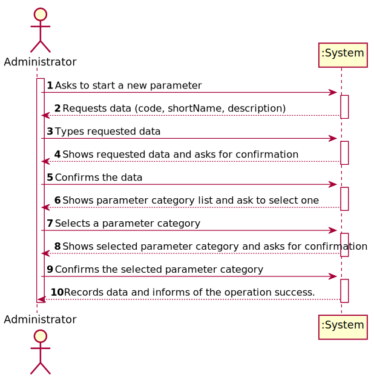
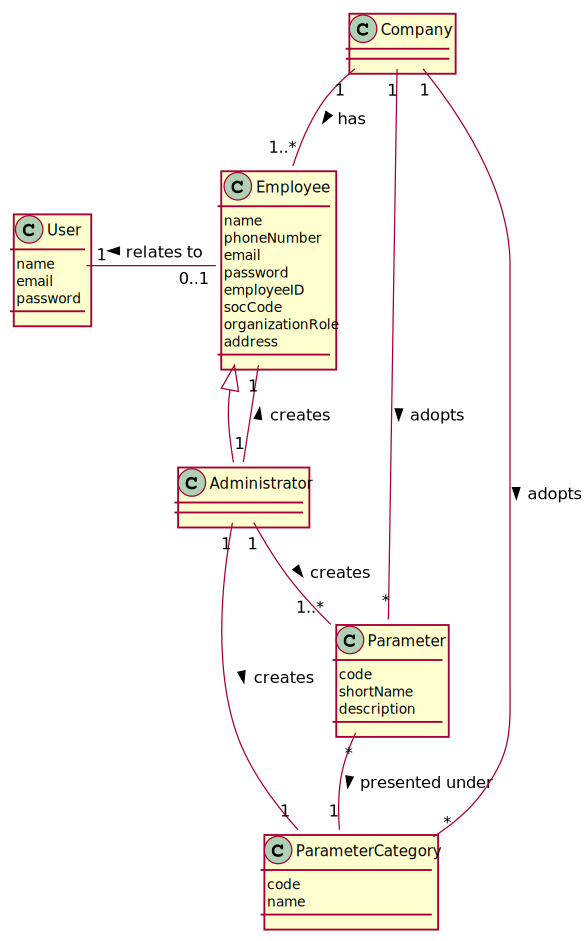
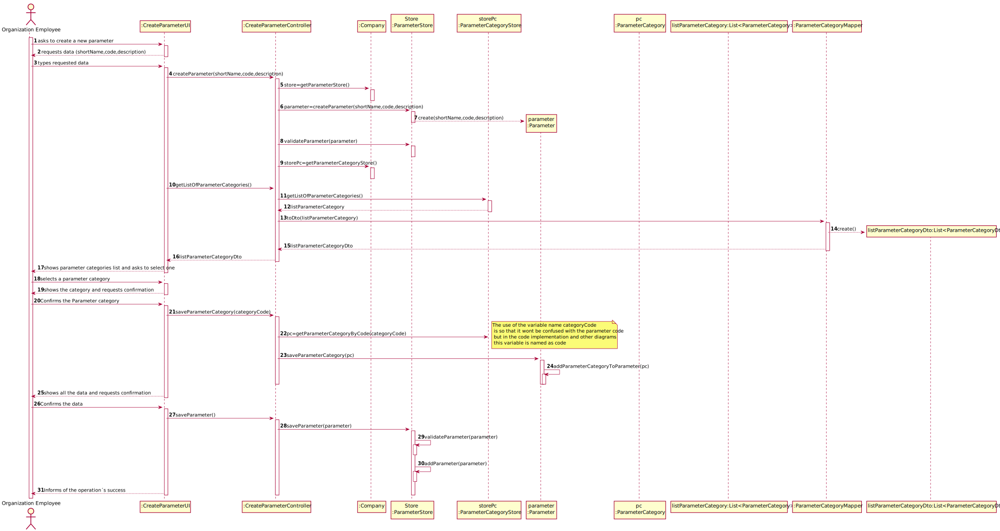
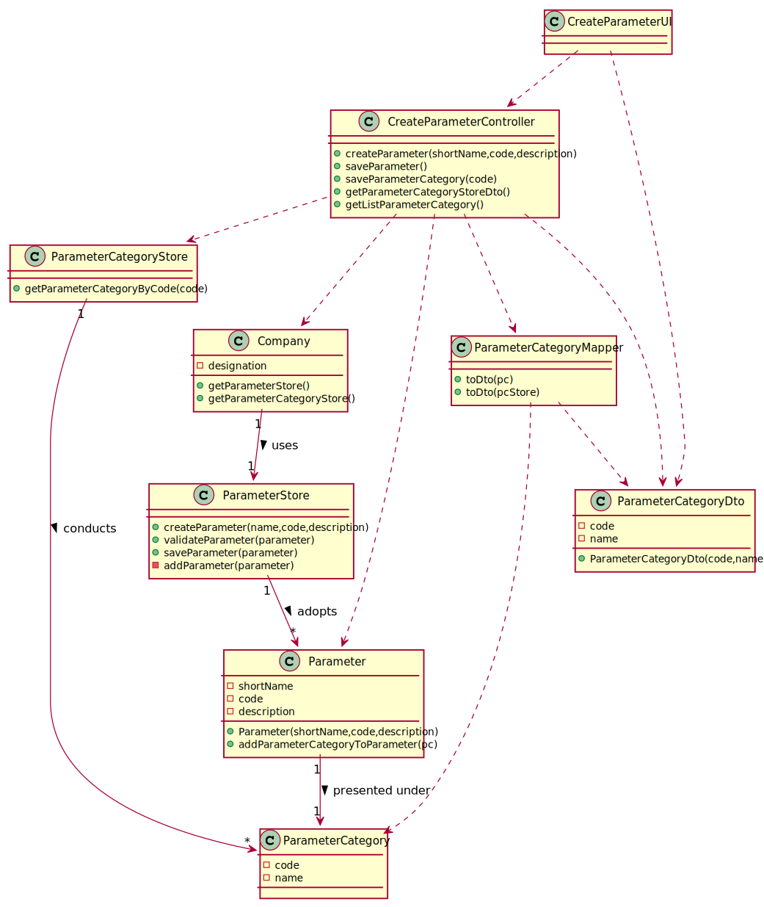

# US 010 - Specify new Parameter and Categorize it

## 1. Requirements Engineering

*In this section, it is suggested to capture the requirement description and specifications as provided by the client as well as any further clarification on it. It is also suggested to capture the requirements acceptance criteria and existing dependencies to other requirements. At last, identfy the involved input and output data and depicted an Actor-System interaction in order to fulfill the requirement.*

### 1.1. User Story Description

As an **administrator**, I want to specify a new **parameter** and **categorize it**.

### 1.2. Customer Specifications and Clarifications

**From the specifications document:**

>	"Blood tests are frequently characterized by measuring several **parameters** which for
presentation/reporting purposes are organized by **categories**. For example, **parameters** such
as the number of Red Blood Cells (RBC), White Blood Cells (WBC) and Platelets (PLT) are
usually presented under the blood count (Hemogram) **category**."

>   "Covid tests are characterized by measuring a single **parameter** stating whether it is a positive
or a negative result."

>  "Despite being out of scope, the system should be developed having in mind the need to
easily support other kinds of tests (e.g., urine). Regardless, such tests rely on measuring one
or more **parameters** that can be grouped/organized by **categories**."

**From the client clarifications:**

> **Question:** What is the data that characterize a parameter? Should we follow the same data as the parameter category, for example, would each parameter have its own code, description and NHS identifier?  
> **Answer:** Each parameter is associated with one category. Each parameter has a Code, a Short Name and a Description.

>**Question:** What is the data that characterize a parameter? Should we follow the same data as the parameter category, for example, would each parameter have its own code, description and NHS identifier?
Each parameter is associated with one category. Each parameter has a Code, a Short Name and a Description.  
**Answer:** The Code are five alphanumeric characters. The Short Name is a String with no more than 8 characters. The Description is a String with no more than 20 characters
### 1.3. Acceptance Criteria

* AC1: code must have 5 alphanumeric chars
* AC2: shortName can't have more than 8 char.
* AC3: description can't have more than 20 chars.
* AC4: Each parameter can only be associated with one parameter category
### 1.4. Found out Dependencies

* There is a dependency to "US011 As an administrator, I want to specify a new parameter category" because, to categorize a parameter the system must have categories
  already created.

### 1.5 Input and Output Data

* Typed data:
    * code
    * shortName
    * description

* Selected data:
    * parameterCategory

**Output Data:**

* List of parameter categories
* (In)Success of the operation

### 1.6. System Sequence Diagram (SSD)

*Insert here a SSD depicting the envisioned Actor-System interactions and throughout which data is inputted and outputted to fulfill the requirement. All interactions must be numbered.*

### 1.7 Other Relevant Remarks

* The Administrator only can choose one of the categories that exists in the System.
* The Administrator must be able to specify a new parameter every time he wants to do it.

## 2. OO Analysis

### 2.1. Relevant Domain Model Excerpt
*In this section, it is suggested to present an excerpt of the domain model that is seen as relevant to fulfill this requirement.*

### 2.2. Other Remarks

*In Relevant Domain Model Excerpt pops up the associations between Administrator and Parameter with category, because without that the excerpt doesn't make sense. So for that US what matters is the association between Administrator and Parameter.*

## 3. Design - User Story Realization

### 3.1. Rationale

**The rationale grounds on the SSD interactions and the identified input/output data.**

| Interaction ID | Question: Which class is responsible for... | Answer  | Justification (with patterns)  |
|:-------------  |:--------------------- |:------------|:---------------------------- |
| Step 1: Asks to start a new parameter  		 |	... interacting with the actor? | CreateParameterUI   |  Pure Fabrication: there is no reason to assign this responsibility to any existing class in the Domain Model.           |
| 			  		 |	... coordinating the US? | CreateParameterController | Controller     |
|                                    | ... knowing the stores? | Company |IE: Company knows all the Stores. |
| 			  		 |	... instantiating a new Parameter? | ParameterStore  | Creator (Rule 1): ParameterStore has all the parameters.    |
| Step 2: Requests data(code, description,shortName) 		 | CreateParameterUI  | IE: is responsible for user interactions.  | 
| Step 3: Types requested data   |  ... saving the typed data? | Parameter | IE: knows all the data. |
| Step 4: Shows requested data and asks for confirmation  		 |	CreateParameterUI  | IE: is responsible for user interactions.  |   IE: is responsible for user interactions.| 
| Step 5: | | |
| Step 6: Shows parameter category list and ask to select one| ... showing the list of parameter category | CreateParameterUI  | IE: is responsible for user interactions.  |
| Step 7: Selects a parameter category 		 |	... knowing the selected parameter category? | ParameterCategoryStore | IE: owns all the parameter categories.  |
| Step 8: Shows selected data and asks for confirmation 		 |  ... how the parameter will be shown | CreateParameterUI  | IE: is responsible for user interactions.  |
| Step 9: Confirms the selected category |... saving the chosen parameter category	| Parameter	|IE: Parameter is responsible for saving  the chosen parameter Categories  |	
|                        | ... validating all data (local validation)? | Parameter | IE: owns all the data. | 
| 			  		          |	... validating all data (global validation)? | ParameterStore | IE: knows all its tasks.|
| Step 10: Records data and informs of the operation success.		 |	... informing operation success? | CreateParameterUI  | IE: is responsible for user interactions.  | 

### Systematization ##

According to the taken rationale, the conceptual classes promoted to software classes are:

* ParameterCategory
* Parameter
* Company

Other software classes (i.e. Pure Fabrication) identified:

* CreateParameterUI
* CreateParameterController
* ParameterStore
* ParameterCategoryStore

## 3.2. Sequence Diagram (SD)

*In this section, it is suggested to present an UML dynamic view stating the sequence of domain related software objects' interactions that allows to fulfill the requirement.*

## 3.3. Class Diagram (CD)

*In this section, it is suggested to present an UML static view representing the main domain related software classes that are involved in fulfilling the requirement as well as and their relations, attributes and methods.*

# 4. Tests
*In this section, it is suggested to systematize how the tests were designed to allow a correct measurement of requirements fulfilling.*

**_DO NOT COPY ALL DEVELOPED TESTS HERE_**

**Section 1:** Check that it is not possible to create an instance of the Parameter with the code in the wrong format - AC1.

       @Test(expected = IllegalArgumentException.class)
       public void checkCodeRulesBlank() {
           Parameter par = new Parameter("", "Blood", "Take a sample");
       }
   
       @Test(expected = IllegalArgumentException.class)
       public void checkCodeRulesLess() {
           Parameter par = new Parameter("123", "Blood", "Take a sample");
       }
   
       @Test(expected = IllegalArgumentException.class)
       public void checkCodeRulesGreater() {
           Parameter par = new Parameter("123456", "Blood", "Take a sample");
       }
       
**Section 2:** Check that it is not possible to create an instance of the Parameter with the short name in the wrong format - AC2.

       @Test(expected = IllegalArgumentException.class)
       public void checkNameRulesBlank() {
               Parameter par = new Parameter("12345", "", "Take a sample");
           }
       
       @Test(expected = IllegalArgumentException.class)
        public void checkNameRulesGreat() {
               Parameter par = new Parameter("12345", "BloodBlood", "Take a sample");
       }
       
**Section 3:** Check that it is not possible to create an instance of the Parameter with the description in the wrong format - AC3.
     
       @Test(expected = IllegalArgumentException.class)
       public void checkDescriptionRulesBlank() {
            Parameter par = new Parameter("12345", "Blood", "");
       }
       
       @Test(expected = IllegalArgumentException.class)
       public void checkDescriptionRulesGreater() {
           Parameter par = new Parameter("12345", "Blood", "TakeASampleTakeASampleTakeASample");
       }             

*It is also recommended to organize this content by subsections.*

# 5. Construction (Implementation)

*In this section, it is suggested to provide, if necessary, some evidence that the construction/implementation is in accordance with the previously carried out design. Furthermore, it is recommeded to mention/describe the existence of other relevant (e.g. configuration) files and highlight relevant commits.*

*It is also recommended to organize this content by subsections.*

## Class CreateParameterController

     public boolean createParameter(String code, String shortName, String description){
         identifyStore();
         this.parameter=this.store.createParameter(code,shortName,description);
         return this.store.validateParameter(parameter);
     }
     
     private List<ParameterCategory> getParameterCategoryStore() {
          return company.getParameterCategoryStore().getCategoryStore();
     }
     
         
     public List<ParameterCategoryDto> getParameterCategoryStoreDto(){
          ParameterCategoryMapper m = new ParameterCategoryMapper();
          return m.toDTO(getParameterCategoryStore());
     }
     
## Class ParameterStore

      public Parameter createParameter(String code, String shortName, String description) {
             return new Parameter(code, shortName, description);
      }
     
         
      public boolean validateParameter(Parameter p) {
          if (p == null) {
              return false;
          }
          if (paramStore.contains(p)) {
              throw new IllegalArgumentException("There already exists a parameter with that information");
          }
          return true;
      }
      
## Class Company

     public ParameterStore getParameterStore() {
          return parameterStore;
     }
     
## Class Parameter

     public Parameter(String code, String shortName, String description){
     
          checkCodeRules(code);
          this.code=code;
     
          checkNameRules(shortName);
          this.shortName=shortName;
     
          checkDescriptionRules(description);
          this.description=description;
     } 

# 6. Integration and Demo

*In this section, it is suggested to describe the efforts made to integrate this functionality with the other features of the system.*

*There is an Administrator Menu, that can be accessed by all the registered Administrators, where there are all the options (User Stories) of the Administrator.*
*The option that allows to specify a new Parameter and categorize it (US-10), permits the Administrator to create a new Parameter in the System.*

# 7. Observations

*In this section, it is suggested to present a critical perspective on the developed work, pointing, for example, to other alternatives and or future related work.*

*With the work until now, with this User Story is possible to create a Parameter, but if the team did not have developed the US-11 (As an Administrator, I want to specify a new Parameter Category), this User Story would be useless.*
