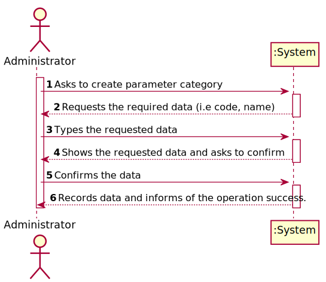
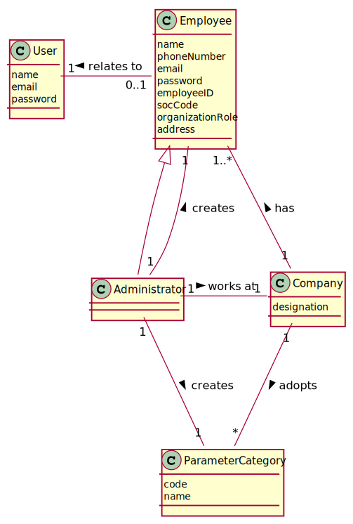
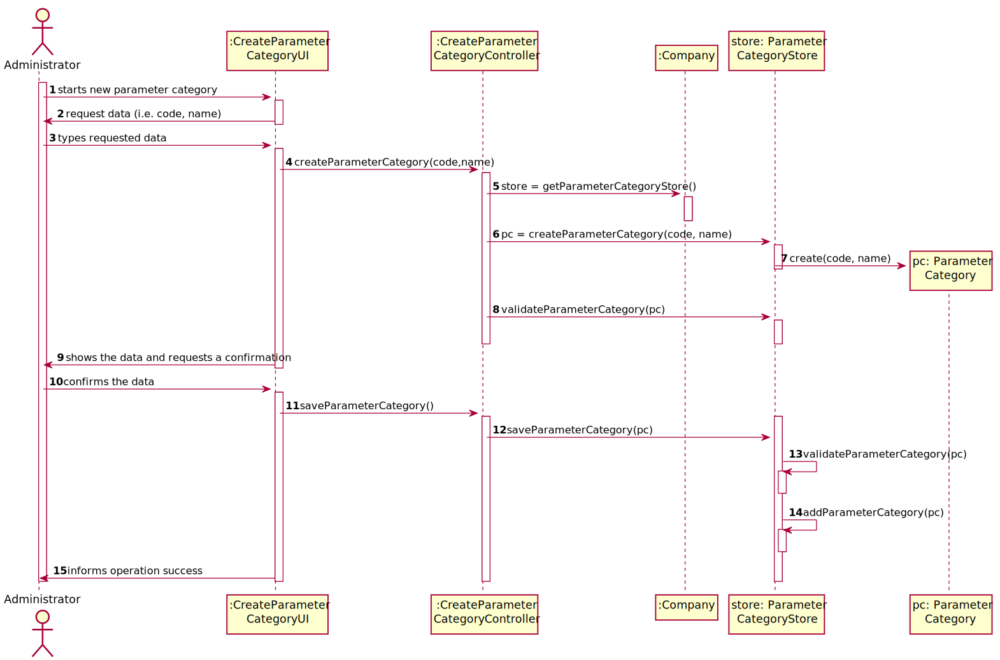
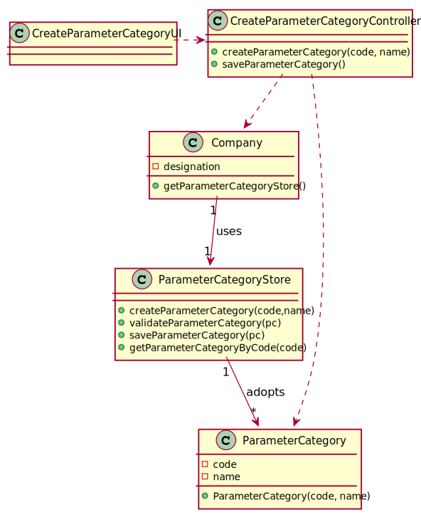

# US 011 - Specify a new parameter category

## 1. Requirements Engineering

*In this section, it is suggested to capture the requirement description and specifications as provided by the client as well as any further clarification on it. It is also suggested to capture the requirements acceptance criteria and existing dependencies to other requirements. At last, identfy the involved input and output data and depicted an Actor-System interaction in order to fulfill the requirement.*

### 1.1. User Story Description

*As an administrator, I want to specify a new parameter category.*

### 1.2. Customer Specifications and Clarifications 

#### From the Specifications Document:
>* “Blood tests are frequently characterized by measuring several parameters which for presentation/reporting purposes are organized
by categories. For example, parameters such as the number of Red Blood Cells (RBC), White Blood Cells (RBC) and Platelets (PLT) are
usually presented under the blood count (Hemogram) category.”

>* Regardless, such tests rely on measuring one or more parameters that can be grouped/organized by categories.”

#### From the client clarifications:
> * Question: Regarding the creation of a new category, what should be the format of the code in terms of length, should it be alphanumeric or numbers only? Also, can we assume that both attributes are mandatory?  
  Answer: The format of the attributes of one category are:  
  Name: is a string with no more than 10 characters;  
  Code: are five alphanumeric characters. The code is unique and is not automatically generated.  
  Both attributes are mandatory.  
  There are no subcategories.  

### 1.3. Acceptance Criteria

* **AC1**: The code must be unique having 5 alphanumeric chars
* **AC2**: The name must be string with no more than 10 characters;

### 1.4. Found out Dependencies

*No dependencies were found.*

### 1.5 Input and Output Data

#### Input Data
* Typed data:   
  * code  
  * name
* Selected data: (none)

#### Output Data
* (In)Success of the operation

### 1.6. System Sequence Diagram (SSD)

*Insert here a SSD depicting the envisioned Actor-System interactions and throughout which data is inputted and outputted to fulfill the requirement. All interactions must be numbered.*

### 1.7 Other Relevant Remarks

*Use this section to capture other relevant information that is related with this US such as (i) special requirements ; (ii) data and/or technology variations; (iii) how often this US is held.* 

## 2. OO Analysis

### 2.1. Relevant Domain Model Excerpt 
*In this section, it is suggested to present an excerpt of the domain model that is seen as relevant to fulfill this requirement.* 

### 2.2. Other Remarks

*Use this section to capture some aditional notes/remarks that must be taken into consideration into the design activity. In some case, it might be usefull to add other analysis artifacts (e.g. activity or state diagrams).* 

## 3. Design - User Story Realization 

### 3.1. Rationale

**The rationale grounds on the SSD interactions and the identified input/output data.**

| Interaction ID | Question: Which class is responsible for... | Answer  | Justification (with patterns)  |
|:-------------  |:--------------------- |:------------|:---------------------------- |
| Step 1: Asks to create parameter category |	... interacting with the actor?	 | CreateParameterCategoryUI |  Pure Fabrication: there is no reason to assign this responsibility to any existing class in the Domain Model. |
|  | ... coordinating the User Story? | CreateParameterCategoryController | Controller |
|                                    | ... knowing the stores? | Company |IE: Company knows all the Stores. |
|  | ... instantiating a new parameter category? | ParameterCategoryStore | Creator (Rule 1): ParameterCategoryStore has all the ParameterCategories |
| Step 2: Requests the required data (i.e code, name) | ... requesting the data? | CreateParameterCategoryUI | IE: Is responsible for user interactions. |
| Step 3: | ... saving the typed data? | ParameterCategory | IE: Knows all the data |
| Step 4: Shows the requested data and asks to confirm | ... showing the typed data? | CreateParameterCategoryUI | IE: Is responsible for every user interaction |
| Step 5: Confirms the data | ... validating the data (local validation)? | ParameterCategory | IE: Knows all the data |
|  | ... validating the data (global validation)? | ParameterCategoryStore | IE: Knows all its Parameter Categories |
| |... saving the created ParameterCategory? | ParameterCategoryStore | IE: ParameterCategoryStore adopts/records all the created Parameter Categories.|
| Step 6: Records data and informs of the operation success | ... informing operation success? | CreateParameterCategoryUI | IE: Is responsible for user interactions. |              

### Systematization ##

According to the taken rationale, the conceptual classes promoted to software classes are: 
 * Company
 * ParameterCategory

Other software classes (i.e. Pure Fabrication) identified: 
 * CreateParameterCategoryUI  
 * CreateParameterCategoryController
 * ParameterCategoryStore

## 3.2. Sequence Diagram (SD)

*In this section, it is suggested to present an UML dynamic view stating the sequence of domain related software objects' interactions that allows to fulfill the requirement.* 

## 3.3. Class Diagram (CD)

*In this section, it is suggested to present an UML static view representing the main domain related software classes that are involved in fulfilling the requirement as well as and their relations, attributes and methods.*

# 4. Tests 
*In this section, it is suggested to systematize how the tests were designed to allow a correct measurement of requirements fulfilling.* 

**_DO NOT COPY ALL DEVELOPED TESTS HERE_**

**Section 1:** Check that it is not possible to create an instance of the Parameter Category with the code in the wrong format - AC1.
 
	@Test(expected = IllegalArgumentException.class)
    public void checkCodeRulesExceptionBlank() {
        ParameterCategory pc = new ParameterCategory("", "name");
    }
    @Test(expected = IllegalArgumentException.class)
    public void checkCodeRulesExceptionLessThen() {
        ParameterCategory pc = new ParameterCategory("1234", "name");
    }
    @Test(expected = IllegalArgumentException.class)
    public void checkCodeRulesExceptionGreater() {
        ParameterCategory pc = new ParameterCategory("123456", "name");
    }
    
**Section 2:** Check that it is not possible to create an instance of the Parameter Category with the name in the wrong format - AC2.

    @Test(expected = IllegalArgumentException.class)
    public void checkNameRulesExceptionBlank() {
        ParameterCategory pc = new ParameterCategory("12345", "");
    }
    @Test(expected = IllegalArgumentException.class)
    public void checkNameRulesExceptionIsGreaterThen() {
        ParameterCategory pc= new ParameterCategory("12345", "namethatisa");
    }

*It is also recommended to organize this content by subsections.* 

# 5. Construction (Implementation)

*In this section, it is suggested to provide, if necessary, some evidence that the construction/implementation is in accordance with the previously carried out design. Furthermore, it is recommeded to mention/describe the existence of other relevant (e.g. configuration) files and highlight relevant commits.*

*It is also recommended to organize this content by subsections.* 

## Class CreateParameterCategoryController

    public boolean createParameterCategory(String code, String name) {
        this.pc = this.company.getParameterCategoryStore().createParameterCategory(code,name);
        return this.company.getParameterCategoryStore().validateParameterCategory(pc);
    }

## Class ParameterCategoryStore

    public ParameterCategory createParameterCategory(String code, String name) {
        return new ParameterCategory(code, name);
    }
       
    public boolean validateParameterCategory(ParameterCategory pc) {
        if (pc == null) {
            return false;
        }
        if (categoryStore.contains(pc)) {
            throw new IllegalArgumentException("There already exists a parameter category with that information");
        }
        return true;
    }
    
## Class Company

    public ParameterCategoryStore getParameterCategoryStore() {
        return parameterCategoryStore;
    }
    
## Class ParameterCategory

    public ParameterCategory(String code, String name) {
        checkCodeRules(code);
        checkNameRules(name);
        this.code = code;
        this.name = name;
    }
    
## Class ParameterCategoryList

    public ParameterCategoryList(){
            this.cl=new ArrayList<>();
    }
    
        
    public boolean validateParameterCategory(ParameterCategory pc) {
        if (pc == null) {
            return false;
        }
        return !cl.contains(pc);
    }
    
## Class ParameterCategoryMapper

    public ParameterCategoryDto toDTO(ParameterCategory pc) {
        return new ParameterCategoryDto(pc.getCode(),pc.getName());
    }
    
    
    public List<ParameterCategoryDto> toDTO(List<ParameterCategory> pcStore {
        List<ParameterCategoryDto> parameterCategoryDTO = new ArrayList<>();
        for(ParameterCategory pc: pcStore ) {
            parameterCategoryDTO.add(this.toDTO(pc));
        }
        return parameterCategoryDTO;
    }
    
## Class ParameterCategoryDto

    public ParameterCategoryDto(String code, String name) {
        this.code=code;
        this.name = name;
    }

# 6. Integration and Demo 

*In this section, it is suggested to describe the efforts made to integrate this functionality with the other features of the system.*

*There is an Administrator Menu, that can be accessed by all the registered Administrators, where there are all the options (User Stories) of the Administrator.*
*The option that allows to specify a new Parameter Category (US-11), permits the Administrator to create a new Parameter Category in the System.*

# 7. Observations

*In this section, it is suggested to present a critical perspective on the developed work, pointing, for example, to other alternatives and or future related work.*

*With the work until now, with this User Story is possible to create a Parameter Category, but if the team did not have developed the US-10 (As an Administrator, I want to specify a new Parameter and categorize it), this User Story would be useless.*

