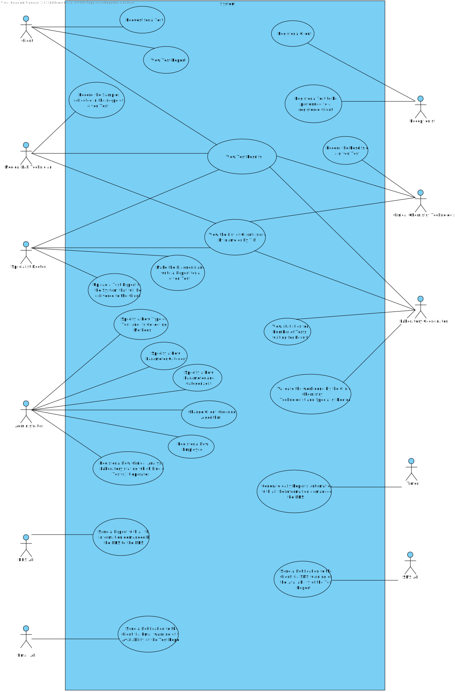

# Use Case Diagram (UCD)

# Use Cases / User Stories
| UC/US  | Description                                                               |                   
|:----|:------------------------------------------------------------------------|
| US1 | [As a client, I intend to request a test.](US1.md)|
| US2 | [As a client, I intend to view the test report. ](US2.md)|
| US3 | [As a receptionist, I want to register a client. ](US3.md)|
| US4 | [As a receptionist of the laboratory, I intend to register a test to be performed to a registered client.](US4.md)|
| US5 | [As a medical lab technician, I want to record the samples collected in the scope of a given test.](US5.md)|
| US6 | [As a client, I intend to view the test results. ](US6.md)|
| US7 | [As an administrator, I want to register a new employee. ](US7.md)|
| US8 | [As an administrator, I want to register a new clinical analysis laboratory stating which kind of test(s) it operates. ](US8.md)|
| US9 | [As an administrator, I want to specify a new type of test and its collecting methods. ](US9.md)|
| US10 | [As an administrator, I want to specify a new parameter and categorize it. ](US10.md)|
| US11 | [As an administrator, I want to specify a new parameter category. ](US11.md)|
| US12 | [As a clinical chemistry technologist, I intend to record the results of a given test](US12.md)|
| US13 | [As a specialist doctor, I want to upload a test report to the system that will be delivered to the client. ](US13.md)|
| US14 | [As a specialist doctor, I intend to make the diagnosis and write a report for a given test. ](US14.md)|
| US15 | [As a laboratory coordinator, I want to validate the work done by the clinical chemistry technologist and specialist doctor. ](US15.md)|
| US16 | [As a specialist doctor, I want to view the list of clients sorted by name or by TIN. ](US16.md)|
| US17 | [As a specialist doctor, I want to view the test results of the client. ](US17.md)|
| US18 | [As laboratory coordinator, I want to view statistics for the number of tests waiting for the result. ](US18.md)|
| US19 | [As laboratory coordinator, I want to view the test results of the client. ](US19.md)|
| US20 | [As laboratory coordinator, I want to view the list of clients sorted by name or by TIN. ](US20.md)|
| US21 | [As a medical lab technician, I want to view the list of clients sorted by name or by TIN. ](US21.md)|
| US22 | [As a clinical chemistry technologist, I want to view the test results of the client. ](US22.md)|
| US23 | [As a clinical chemistry technologist, I want to view the list of clients sorted by name or by TIN. ](US23.md)|
| US24 | [As an administrator, I want to change the client ordering algorithm through a configuration file. ](US24.md)|
| US25 | [As a barcode API, I want to generate a barcode. ](US25.md)|
| US26 | [As a NHS API, I want to send a report with all the information demanded by the NHS to the NHS. ](US26.md)|
| US27 | [As a timer, I want to generate daily reports automatically with all the information demanded by the NHS. ](US27.md)|
| US28 | [As a email API, I want to send a notification to the client via email warning of the availability of the test report. ](US28.md)|
| US29 | [As a SMS API, I want to send a notification to the client via SMS warning of the availability of the test report. ](US29.md)|
| US30 | [As a medical lab technician, I want to identify a sample with a barcode. ](US30.md)|
| US31 | [As a medical lab technician, I want to view the test results of the client. ](US31.md)|

