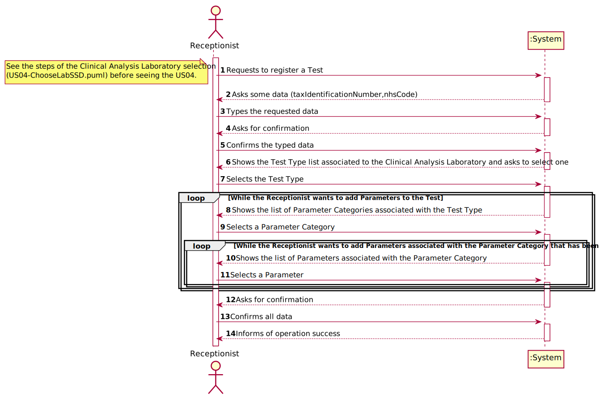
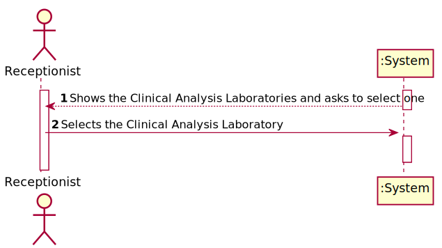
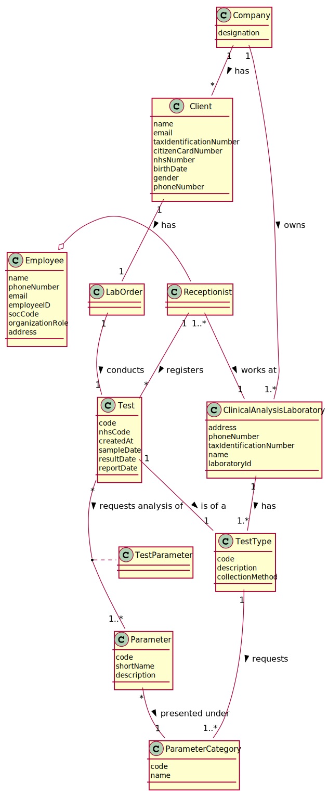
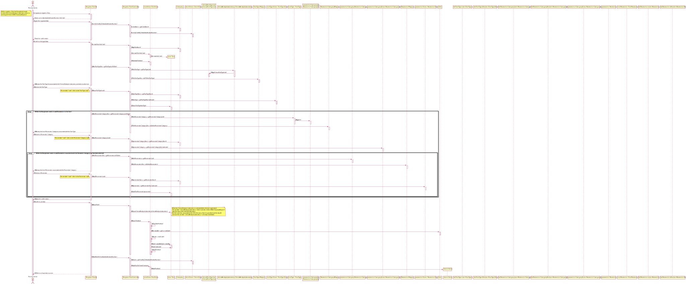
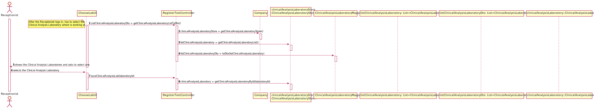
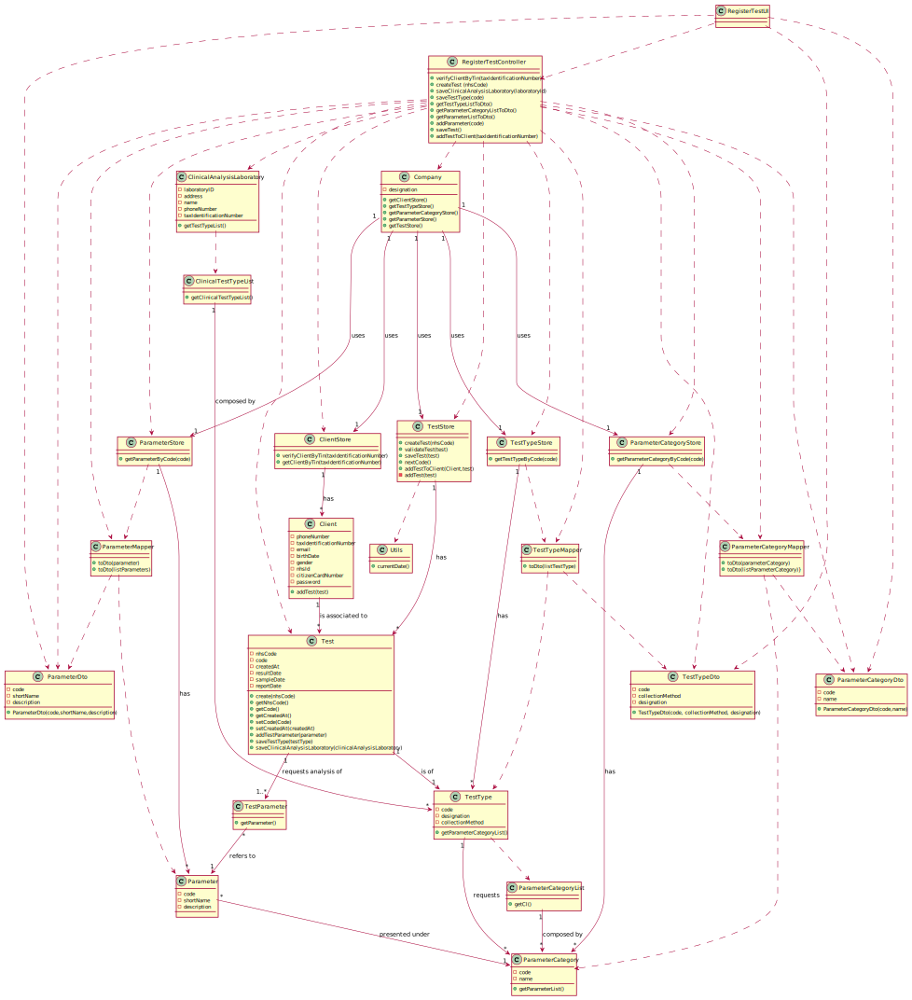

# US 004 - Register Test

# US 004 - Register Test

## 1. Requirements Engineering

### 1.1. User Story Description

*As a **receptionist** of the laboratory, I intend to register a **test** to be performed to a registered **client**.*

### 1.2. Customer Specifications and Clarifications 

**From the specifications document:**

>   * Typically, the **client** arrives at one of the clinical analysis laboratories with a lab order prescribed by
      a doctor. Once there, a receptionist asks the client’s **citizen card number**, the lab order (which
      contains the **type of test** and **parameters** to be measured), and registers in the application the **test** to
      be performed to that client. Then, the client should wait until a medical lab technician calls him/her
      to collect the samples required to perform a given test.
      
      
**From the client clarifications:**
>   * **Question:** When the receptionist chooses the test type, should the categories appear, and then when selecting the category, the receptionist can choose the parameters for the test? Or when the Receptionist chooses the test type, should appear all the parameters that it includes immediately?
>
>     * **Answer:**  Firstly, the receptionist should choose a test type. Then choose a category from a set of categories. Last, the receptionist should choose a parameter.
>         
>   * **Question:** What are the attributes of a test and the acceptance criteria?
>
>     * **Answer:**  A test has the following attributes:
>                    Test code : Sequential number with 12 digits. The code is automatically generated.
>                    NHS code: 12 alphanumeric characters.
>
>  * **Question:** When the receptionist is registering a test for a client, the test can have more than one category and many parameters of the chosen categories or it only can have one category?
>
>     * **Answer:** Each test can have more than one category.
>
>  * **Question(related to other user story, but useful):** After validation do we need to have the time and date of the validation?
>
>     * **Answer:** Yes, the system should record the date (DD/MM/YYYY) and time (HH:MM) when the validation was made.
>                   Moreover, in this US, when the system shows to the laboratory coordinator all the dates (test registration date, chemical analysis date and diagnosis date), the system should show the date (DD/MM/YYYY) and the time (HH:MM).
>
>  * **Question:** I wanted to ask if the NHS code of which test is unique or not.
>
>     * **Answer:** Yes.
>
>  * **Question:** In the answered questions from the US4 , you say "The TIN number should be used to find a client and associate the client with the test" but in the project description we have :
>                   "Once there, a receptionist asks the client’s citizen card number, the lab order (which
>                   contains the type of test and parameters to be measured), and registers in the application the test to
>                  be performed to that client."
>                    If is not asking too much, please clarify me this : 
>                   Shouldn't the receptionist locate the Client by the Citizen Card Number instead of TIN Number?
>
>     * **Answer:** The receptionist should use the TIN number to find the client.
>
>  * **Question:** We are aware that both the receptionist and the MLT are two employees that may work on different labs. As such, do you want that Tests become associated to a specific Lab?
>
>     * **Answer:** Yes.
>
>  * **Question:** How is it possible to know in which laboratory the test is being registered? Should the Receptionist select the Laboratory before selecting the Test Type?
>
>     * **Answer:** After login, the receptionist should select the laboratory where she is working. Then, the receptionist has access to the system's features/functionalities.
>
>
### 1.3. Acceptance Criteria

* **AC1:**  Tax Identification Number (TIN) must have 10 digits.
* **AC2:**  NHS Code must have 12 alphanumeric characters.
* **AC3:**  Test Code must have 12 digits.
* **AC4:**  Test Code must be a sequential number automatically generated.
* **AC5:**  Test Creation date mut be at (DD/MM/YYYY) format with time at the format (HH:MM)
* **AC6:**  The Test only contains a unique test type.
* **AC7:**  Each Test can have more than one category.
* **AC8:**  The Test can contain one or more parameters.
* **AC9:**  NHS Code must be unique for each test.

### 1.4. Found out Dependencies

* There is a dependency with "US03 As a receptionist of the laboratory, I want to register a client" because the client needs to be registered in the
  system to have tests associated.
* There is a dependency with "US08 As an administrator, I want to register a new clinical analysis laboratory stating which
 kind of test(s) it operates", because the receptionist needs to select a clinical analysis laboratory to see the Test Types available there.  
* There is a dependency with "US09 As an administrator, I want to specify a new type of test and its collecting methods" because the System must
have Test Types for the receptionist to select.
* There is a dependency with "US10 As an administrator, I want to specify a new parameter and categorize it" because the System must have parameters
for the receptionist to select.
* There is a dependency with "US11 As an administrator, I want to specify a new parameter category" because the System must have categories to keep
the parameters for the receptionist to select.
  
### 1.5 Input and Output Data
**Input Data:**

* Typed data:
	*  a TIN, 
	*  a NHS code,
	
* Selected data: 
    *  the Test Type,
    *  the Parameter Category,
    *  the Parameters 
    

**Output Data:**

 *  List of Test Types
 *  List of Parameter Categories
 *  List of Parameters
 *  (In)Success of test registration operation  

### 1.6. System Sequence Diagram (SSD)

*Insert here a SSD depicting the envisioned Actor-System interactions and throughout which data is inputted and outputted to fulfill the requirement. All interactions must be numbered.*

*Complementing the SDD (Relevant for the US) :*

### 1.7 Other Relevant Remarks

* This function must be available when the receptionist needs to register a test 

## 2. OO Analysis

### 2.1. Relevant Domain Model Excerpt 
*In this section, it is suggested to present an excerpt of the domain model that is seen as relevant to fulfill this requirement.* 

### 2.2. Other Remarks

* N/A

## 3. Design - User Story Realization 

### 3.1. Rationale

**The rationale grounds on the SSD interactions, and the identified input/output data.**

| Interaction ID | Question: Which class is responsible for... | Answer  | Justification (with patterns)  |
|:-------------  |:--------------------- |:------------|:---------------------------- |
| Step 1: Requests to register a Test		 |	... interacting with the actor? | RegisterTestUI  |  **Pure Fabrication**: there is no reason to assign this responsibility to any existing class in the Domain Model. |
| 			  		 |	... coordinating the US ? | RegisterTestController | **Pure Fabrication**: Controller.                             |
| 			  		 |	... instantiating a new Test ? | TestStore  | **Creates all the Tests**.   |
| Step 2: Requests data (nhsCode,citizenCardNumber) . 		 |	... requesting the data?						 |      RegisterTestUI       |  **IE**: Is responsible for user interactions.                            |
| Step 3: Types the requested data 		 |	... typing the data ? | Receptionist| **IE**: is responsible for typing all data.  |
| 			  		                 |	... saving the typed data ? | TestStore | **IE**: knows all the data.                             |
|                                    | ... maintaining the store ? | Company | **Maintains all the Stores.** |
|                                     |... verify the citizen card number ?|ClientStore | **IE**: knows all the Clients.|
| Step 4: Asks for confirmation. |...  showing the data?| TestStore and ClientStore | **IE**: are responsible for all Test and Client data.  | 
| Step 5: Confirms the typed data. |   ... validating all data (local validation) ? | Test and Client| **IE**: knows its own data. |
| 			  		                |   ... validating all data (global validation) ? | TestStore | **IE**: knows all the Test objects. | 
| 			  		                |   ... saving the created task ? | TestStore | **IE**: adopts/records all Test objects . | 
| Step 6: Shows the Test Type list associated to the Clinical Analysis Laboratory and asks to select one                                                              |  ...knowing all the Test Types to show? | ClinicalTestTypeList|**IE**: adopts/records all TestType objects associated with the clinical analysis laboratory.|
|               | ... transforming a Test Type into a Data Transfer Object ? | TestTypeMapper| **Mapper**: Converts objects into Dtos.|
|               |... transfer the list of Test Types from the Domain to the UI| TestTypeDto| **Dto**: Using a Dto to reduce coupling between the Domain and the UI.|
|                                                                                                         |... have the ClinicalTestTypeList ?|ClinicalAnalysisLaboratory |**IE**: is responsible for having a list with the Test Types associated to the selected Clinical Analysis Laboratory. |                         
| Step 7:	Selects the Test Type		  		                |   ... identifying the chosen Test Type ? | TestTypeStore |**IE**: adopts/records all TestType objects. | 
| Step 8:	Shows the list of Parameter Categories associated with the Test Type  		                |   ... all the Parameter Categories to show ?| ParameterCategoryList |**IE**: adopts/records all Parameter Category objects associated to the selected Test Type. |
|                                                                                                       | ... have the ParameterCategoryList ? | TestType | **IE**: is responsible for having a list with the Parameter Categories associated to the selected Test Type.|
|               | ... transforming a Parameter Category into a Data Transfer Object ? | ParameterCategoryMapper| **Mapper**: Converts objects into Dtos.|
|               |... transfer the list of Parameter Categories from the Domain to the UI| ParameterCategoryDto| **Dto**: Using a Dto to reduce coupling between the Domain and the UI.|
| Step 9:  Selects a Parameter Category	                |   ... identifying the chosen Parameter Category ? | ParameterCategoryStore | **IE**: adopts/records all ParameterCategory objects. | 
| Step 10:  Shows the list of Parameters associated with the Parameter Category 		                |   ... knowing all the Parameters to show ? | ParameterCategory | **IE**: adopts/records all Parameter objects associated to the selected Parameter Category. |
|               | ... transforming a Parameter into a Data Transfer Object ? | ParameterMapper| **Mapper**: Converts objects into Dtos.|
|               |... transfer the list of Parameters from the Domain to the UI ? | ParameterDto| **Dto**: Using a Dto to reduce coupling between the Domain and the UI.|
| Step 11:	Selects a Parameter	  		                |   ... identifying the chosen Parameter ? | ParameterStore | **IE**: adopts/records all Parameter objects. | 
|                                                         | ... the construction of a new parameter ?| Parameter | **IE**: creates all the Parameters.| 
|                                                         | ... keeping the parameter ? | TestParameter | **IE*** : keeps all the parameters related to a certain Test.|         
| Step 12:	Shows all data and asks for confirmation		  		               | ... Asking for confirmation ?| RegisterTestUI  | **IE**: is responsible for user interactions.  | 
| Step 13:	Confirms all data	  		                |   ... validating all data (local validation) ?| Test| **IE**: knows its own data. | 
 |                                                       | ... generating the Date ?| Utils| **Pure Fabrication**: has the necessary information to generate the Date.|                   
| Step 14: Informs operation success. |	... informing operation success ? | RegisterTestUI  | **IE**: is responsible for user interactions.  |

### Systematization ##

According to the taken rationale, the conceptual classes promoted to software classes are: 

 * Test
 * TestType
 * Parameter
 * ParameterCategory
 * ClinicalAnalysisLaboratory
 * Client
 * Company

Other software classes (i.e. Pure Fabrication) identified: 
 
 * TestParameter
 * Utils
 * RegisterTestUI
 * RegisterTestController
 * ParameterMapper
 * TestTypeMapper
 * ParameterCategoryMapper
 * ParameterDto
 * TestTypeDto
 * ParameterCategoryDto
 * ParameterStore
 * TestStore
 * ClientStore
 * TestTypeStore
 * ParameterCategoryStore
 * ClinicalTestTypeList
 * ParameterCategoryList
  
  
## 3.2. Sequence Diagram (SD)

*In this section, it is suggested to present an UML dynamic view stating the sequence of domain related software objects' interactions that allows to fulfill the requirement.* 

*Complementing the US04 SD (Relevant for the US):*

## 3.3. Class Diagram (CD)

*In this section, it is suggested to present an UML static view representing the main domain related software classes that are involved in fulfilling the requirement as well as and their relations, attributes and methods.*

# 4. Tests 
*In this section, it is suggested to systematize how the tests were designed to allow a correct measurement of requirements fulfilling.* 

**_DO NOT COPY ALL DEVELOPED TESTS HERE_**

             
             
*It is also recommended to organize this content by subsections.* 

# 5. Construction (Implementation)

*In this section, it is suggested to provide, if necessary, some evidence that the construction/implementation is in accordance with the previously carried out design. Furthermore, it is recommeded to mention/describe the existence of other relevant (e.g. configuration) files and highlight relevant commits.*

*It is also recommended to organize this content by subsections.* 

# 6. Integration and Demo 

*In this section, it is suggested to describe the efforts made to integrate this functionality with the other features of the system.*

* There is a  Receptionist Menu, that can be accessed by all registered Receptionist, where there are all the options (User Stories) of the Receptionist.
* The option that allows to register a new Test (US-04), permits the Receptionist to create a new Test in the System. 
 
# 7. Observations

* With the work developed until now, is possible to register a new Test in the System. 

