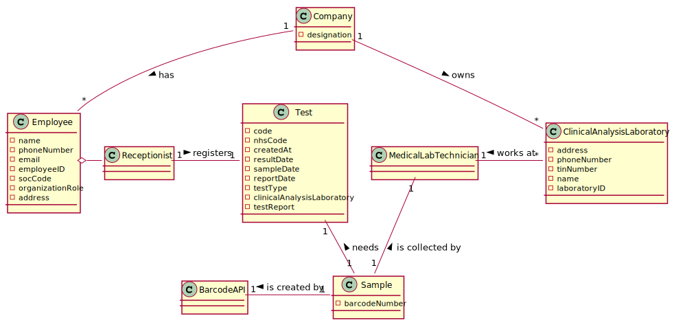

# US 005 - Record Samples

## 1. Requirements Engineering

*In this section, it is suggested to capture the requirement description and specifications as provided by the client as well as any further clarification on it. It is also suggested to capture the requirements acceptance criteria and existing dependencies to other requirements. At last, identfy the involved input and output data and depicted an Actor-System interaction in order to fulfill the requirement.*
  
### 1.1. User Story Description

*As a **Medical Lab Technician**, I want to record the **samples** collected in the scope of a given **test**.*

### 1.2. Customer Specifications and Clarifications 

**From the specifications document:**

>   * "Once there, a receptionist asks the client’s citizen card number, the lab order (which
      contains the type of test and parameters to be measured), and registers in the application the test to
      be performed to that client. Then, the client should wait until a medical lab technician calls him/her
      to collect the samples required to perform a given test."
>   * "All the tests (clinical blood tests and Covid-19 tests) performed by the network of laboratories are
      registered locally by the medical lab technicians who collect the samples. The samples are sent
      daily to the chemical laboratory where the chemical analyses are performed, and results obtained.
      When sampling (blood or swab) the medical lab technician records the samples in the system,
      associating the samples with the client/test, and identifying each sample with a barcode that is
      automatically generated using an external API."

**From the client clarifications:**

>    Question: What kind of attributes should a sample have?
      Answer: Each sample is associated with a test. A sample has only one attribute, a barcode number (UPC) that is a sequential number and is automatically generated by the system. Each sample has a unique barcode number.
              In US5, the medical lab technician checks the system and see all tests for which there are no samples collected. The medical lab technician selects a test and the system asks for the number of samples to collect.

>    Question: Can a test have more than one sample?
      Answer: Yes.

>    Question: We didn't fully understand what will the API do in this US, so here's out interpretation from the US, correct us if we're wrong please: The API will be generated randomly and the API is an attribute from the sample.
      Answer: The API will be used to generate/print barcodes.

>    Question: Why is there the specification for only the tests with no samples?
      Answer: The Medical Lab Technician selects a tests and the number of barcodes he/she wants. Then the system generates the requested barcodes.
      After generating the barcodes, the select test is no more available in the system for generating barcodes.

>    Question: Shouldn't there be a way for technicians to add more samples to an existing test?
      Answer: No.

>    Question. Should there be a validation of the number of samples?
      Answer: No.

>    Question: After the barcodes are generated. The concept-reality link would be, for example to stick each barcode into each sample?
      Answer: Yes. Each generated barcode should be saved in a folder as a jpeg file.

>    Question: It was answered in one of the previous questions that the sample only has one attribute, the barcode, however the description of the project also mentions a date of collection of the samples, is this date supposed to be an attribute of the test and not of the sample itself?
      Answer: Yes. The system should record the date (DD/MM/YYYY) and time (HH:MM) when the sample is collect made. The date and time are automatically generated by the system when the barcode is issued.

>    Question: If there were multiple samples for a single test, would there be only one collection date for all of them?
      Answer: Only one collection date and time for a test.

>    Question: Is there a specific order/priority for the medical lab technician to select the test to which he wants 
      to collect the samples, or is the selection random? If there is an order, how is a test chosen?
      Answer: The medical lab technician selects the test and the system generates the barcodes.
      From a previous post: "The medical lab technician selects a test and the system asks for the number of samples to collect".

>    Question: What is supposed to show to the Medical Lab Technician when he selects the pretended test ?
      Answer: Firstly, the Medical Lab Technician checks the system to see the tests/clients that need to be done. 
      Before selecting a test, the Medical Lab Technician checks/see the name of the client and all the test data 
      (test attributes, test type, collection method, parameters, etc.). Then, the Medical Lab Technician selects one 
      test/client and the system asks for the number of samples to collect. Next, the system generates the barcodes to put in the samples.

>    Question: Regarding US5, after selecting the number of samples for the test chosen by the medical lab tec., 
      should the barcodes be displayed on the screen, or just printed and saved?
      Answer: Should be saved in a file.
      From a previous post: "Each sample has a unique barcode number. Each generated barcode should be saved in a folder as a jpeg file".

>    Question: This means that, when the receptionist creates a new Test, this test will only be "visible" for that specific LAB (for the receptionist and the MLT only), which means that all other roles (Chemistry Technologist, Specialist Doctor and the Laboratory Coordinator) will be able to see a list of all the tests performed in any lab.
      Answer: Yes. The test will only be visible for that specific LAB and for all those working in the Chemical Laboratory.

### 1.3. Acceptance Criteria

- **AC1**: Barcode Number should be generated randomly using and external module Library.
- **AC2**: Each sample has a different barcode.
- **AC3**: Barcode number should be associated to a Sample.
- **AC4**: Barcode should be generated in a folder as a JPEG file.
- **AC5**: Data should have (DD/MM/YYYY) and time should have (HH:MM).
- **AC6**: After selecting the Test, the Test to be Sampled need to be shown to Medical Lab Technician.

### 1.4. Found out Dependencies

* This US depends on US04 because the Receptionist needs to register a Client, for Medical Lab Technician collect the Tests them.

### 1.5 Input and Output Data

- **Input Data**: No input data.
  
- **Selected data**: The tests that doesn't have a sample/s.

### 1.6. System Sequence Diagram (SSD)

### 1.7 Other Relevant Remarks

*For this US we're gonna use an external module Library called "barbecue" to generate barcodes in an automatic way.* 

## 2. OO Analysis

### 2.1. Relevant Domain Model Excerpt 

### 2.2. Other Remarks

- **N/A**

## 3. Design - User Story Realization 

### 3.1. Rationale

**The rationale grounds on the SSD interactions and the identified input/output data.**

| Interaction ID | Question: Which class is responsible for... | Answer  | Justification (with patterns)  |
|:-------------  |:--------------------- |:------------|:---------------------------- |
| Step 1: Asks to show the List of Tests to be Sampled | ... interacting with the actor? | RecordSamplesUI | Pure Fabrication: there is no reason to assign this responsibility to any existing class in the Domain Model. |
|  | ... coordinating the User Story? | RecordSamplesController | Controller |      
| Step 1 (ChooseLabSSD): Shows the Clinical Analysis Laboratories and asks to select one | ... show the ClinicalAnalysisLaboratoryList? | ClinicalAnalysisLaboratoryDTO | IE: Responsible for user interaction between data. |
| Step 2 (ChooseLabSSD): Selects the Clinical Analysis Laboratory | ...receive the selected ClinicalAnalysisLaboratory? | ClinicalAnalysisLaboratoryStore | IE: Responsible for all the data. |
| Step 2: Shows the List of Tests to be sampled | ... show the testsToBeSampledList? | TestDTO | IE: Responsible for user interaction between data. |
| Step 3: Choose the Test from Test to be sampled List | ... who will choose the Test? | MedicalLabTechnician | IE: Is responsible for all the data. |    
|  | ... where Test will be caught? | TestDTO | IE: Is responsible for user interaction. |
|  | ... allowing the data to be typed? | RecordSamplesUI | IE: It is responsible for all user interactions. |
| Step 4: Informs success and ask for how many samples Medical Lab Technician wanna create. |
| Step 5: Introduce a number of samples creating the samples with a automatic barcode for that Test. | ... create a sample for a Test | Sample | IE: Is responsible for all the data. |
|  | ... generate automatically the barcode? | Barbecue | IE: Adopts all barcode numbers |
|  | ... gives the barcode to sample? | BarcodeAdapter | IE: High Cohesion and Low Coupling pattern. |
|  | ... who will type the data? | MedicalLabTechnician | IE: Is responsible for all the data. |
|  | ... create samples with barcode? | BarcodeAPI | IE: It is responsible for all the data. |
| Step 6: Asks for confirmation of a Test with samples | ... who will show the Test? | Test | IE: Responsible for all the data. |
| Step 7: Confirms the Test with the Samples | | |
| Step 8: Informs operation success | ... informing that the operation was a success? | RecordSamplesUI  | IE: It is responsible for all user interactions.  |

### Systematization ##

*According to the taken rationale, the conceptual classes promoted to software classes are:*

 * *Company*
 * *Test*
 * *Sample*
 * *BarcodeAPI*
 * *MedicalLabTechnician*

*Other software classes (i.e. Pure Fabrication) identified:* 

 * *ChooseLabUI*
 * *MedicalLabTechnicianUI*
 * *RecordSamplesUI*
 * *RecordSamplesController*
 * *TestStore*
 * *ClinicalAnalysisLaboratoryStore*
 * *TestDTO*
 * *TestMapper*
 * *ClinicalAnalysisLaboratoryMapper*
 * *ClinicalAnalysisLaboratoryDto*
 * *TestsWithSampleListDTO*
 * *TestsWithSampleListMapper*
 * *BarcodeAdapter*
 * *BarbecueAPI*

## 3.2. Sequence Diagram (SD)

## 3.3. Class Diagram (CD)

# 4. Tests 

**_DO NOT COPY ALL DEVELOPED TESTS HERE_**

**Test 1:** Check if getBarcode() is working well.

	    public void testGetBarcode() throws OutputException, BarcodeException, IOException, ClassNotFoundException, InstantiationException, IllegalAccessException {
        App.getInstance();
        Sample sample = new Sample();
        String expected = "30000000005";
        String result = sample.getBarcode();
        String result2 = sample.getBarcode();
        Assert.assertEquals(expected,result);
        Assert.assertNotEquals(expected,result2);
    }

**Test 2:** Check if toString() is working well.

      public void testToString() throws OutputException, BarcodeException, IOException {
      Sample sample = new Sample();
      String result = sample.toString();
      String expected = "Barcode: 30000000004";
      String expected2 = "Barcode: 30000000000";
      Assert.assertEquals(result,expected);
      Assert.assertNotEquals(result,expected2);
      }

**Test 3:** Check if getBarcodeNumber() is working well.

      public void getBarcodeNumber() throws OutputException, BarcodeException, IOException, ClassNotFoundException, InstantiationException, IllegalAccessException {
      App.getInstance();
      Sample sample = new Sample();
      sample.getBarcode();
      String result = sample.getBarcodeNumber();
      String expected = "30000000007";
      String expected2 = "30000000000";
      Assert.assertEquals(result,expected);
      Assert.assertNotEquals(result,expected2);
      }

# 5. Construction (Implementation)

      public class RecordSamplesController {

      private final Company company;

      private final TestMapper mapper;

      private final TestStore testStore;

      private Test test;

      private Sample sample;

      public RecordSamplesController() throws OutputException, BarcodeException, IOException {
      this(App.getInstance().getCompany());
      }

      public RecordSamplesController(Company company) {
      this.company = company;
      this.testStore = new TestStore();
      this.mapper = new TestMapper();
      }

      public TestStore getTestStore(){
      return this.company.getTestStore();
      }
  
      public List<Test> getTestToBeSampledList(){
      return this.company.getTestStore().getTestsWithoutSamplesList();
      }
  
      public List<TestDto> listDto(){
      return this.mapper.toDTOForSample(getTestToBeSampledList());
      }
  
      public void getTestToBeSampledByIndex(int index){
      this.test=this.company.getTestStore().getTestToBeSampledByIndex(index);
      }

      public void setCurrentDate(){
      this.test.setSampleDate();
      }

      public void createSample() throws OutputException, BarcodeException, IOException, ClassNotFoundException, InstantiationException, IllegalAccessException {
      this.sample = new Sample();
      this.sample.getBarcode();
      this.test.addSampleToTest(sample);
      }
  
      public boolean saveTestWithSamples(){
      return this.testStore.saveTestWithSamples(test);
      }
      }

# 6. Integration and Demo

* Firstly we need to be logged with a Medical Lab Technician account. *
* Second step is to choose what is the Test/Tests that will receive the Sample.*
* And last but not least, the barcode of Samples needs to be generated automatically.

# 7. Observations

*This US take a long time because of barbecue external module problems more specifically with barbecue versions.*
  
