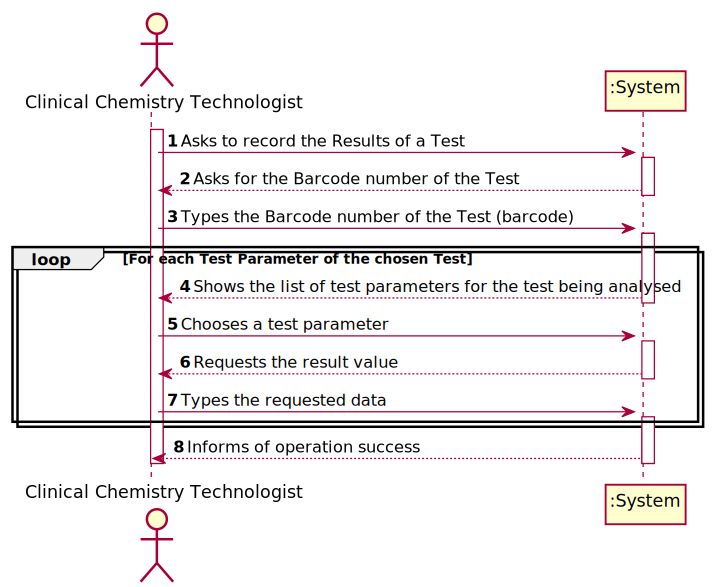
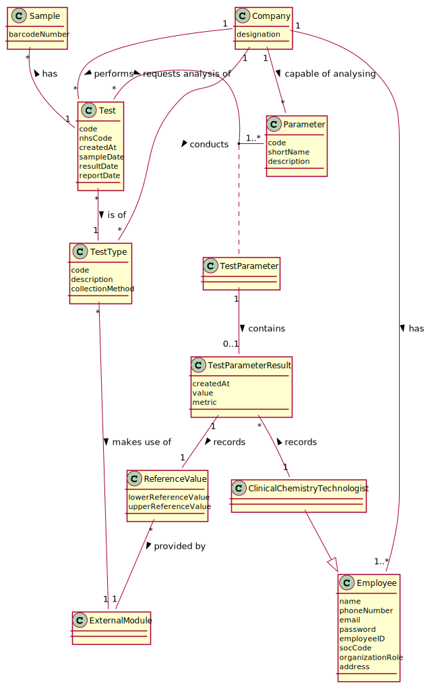
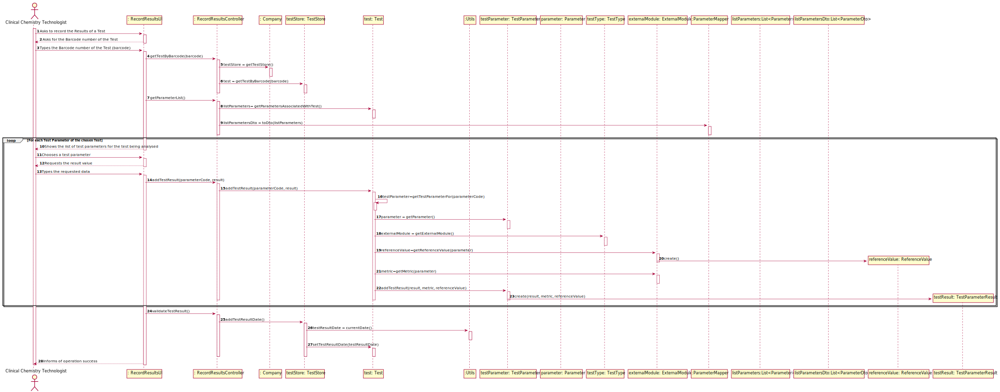
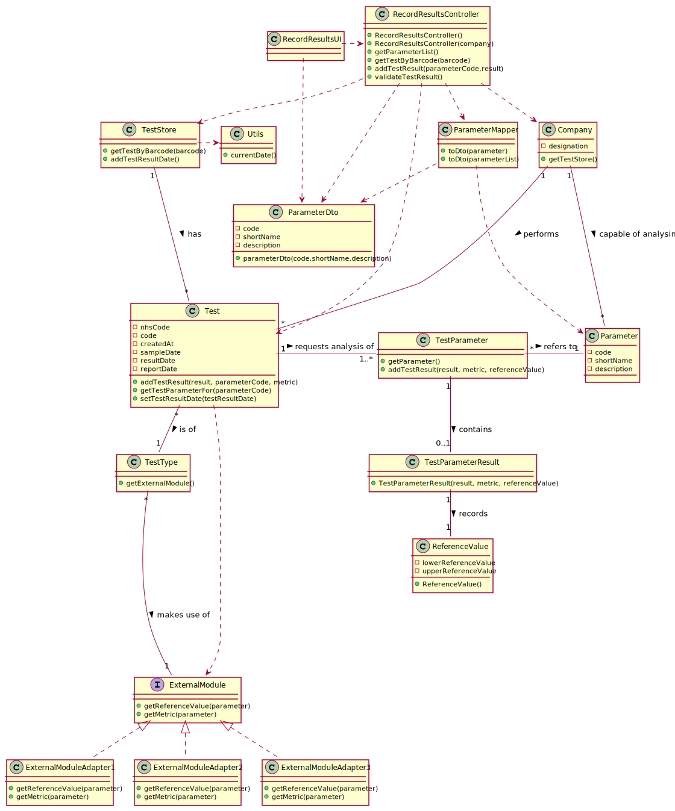

# US 12 - Record Results

## 1. Requirements Engineering

*In this section, it is suggested to capture the requirement description and specifications as provided by the client as well as any further clarification on it. It is also suggested to capture the requirements acceptance criteria and existing dependencies to other requirements. At last, identfy the involved input and output data and depicted an Actor-System interaction in order to fulfill the requirement.*

### 1.1. User Story Description

*As a **clinical chemistry technologist**, I intend to record the **results** of a **given test**.*

### 1.2. Customer Specifications and Clarifications 

#### From the Specifications Document:

> At the company's headquarters, the clinical chemistry technologist receives the samples (delivered
by a courier) and performs the chemical analysis, recording the results in the software application.

>  At the same time the results are also available in the central application where the medical lab technicians
who collect the samples, the clinical chemistry technologist, the specialist doctor, and the laboratory
coordinator can check them.

#### From the Client Specification:

> * Question:
  When the Clinical Chemistry Technologist wants to record the results of a test, how does he has access to that test?
  By internal code, NHS code?  
 Answer:
  Each sample has a unique barcode. 
  The clinical chemistry technologist should use the sample barcode number to find the test for which 
  the sample was collected.
      
> * Question:
  Should the system present a result for each test parameter or a single result for the test to be recorded?  
 Answer:
  The Clinical Chemistry Technologist should register a value/result for each parameter of the test.

> * Question:
  Are the reference values, for each parameter, going to be delivered to the groups? If so, when and how?  
 Answer:
  You should use the APIs available in moodle to obtain the reference values.

>* Question:
  From the Acceptance Criteria we get that "the API request should include, at most: 
  (i) a key to access the module (e.g.: “KEY1234”); (ii) a parameter identifier; (iii) the reference date; 
  and (iv) reference measurement unit (e.g. "mg")."
  Does this "at most" express that there are some parameters of the API request that are optional? 
  If so, could you clarify the parameters that are optional?  
 Answer:
  "At most" means the maximum number of parameters that will be used. Depending on the API being used, 
  all parameters above may be required or some may be optional.
      

### 1.3. Acceptance Criteria

* *AC1*: All the test parameters must have a result for the operation to be a success
* *AC2*: The test must be selected by the number of the barcode that identifies its samples

### 1.4. Found out Dependencies
- **US-04**-This is a dependency because a test must exist for the results to be assigned to it
- **US-05:** *This is a dependency, because the Clinical Chemistry Technologist only will make the result if 
  the Test have a sample.*   
- **US-07**- Clinical Chemistry Technologist must exist for him to input the results.

### 1.5 Input and Output Data

**Input data:**

* Typed data:
  * the barcode number that identifies a test
  * the result values for the various test parameters.
    
* Selected data: 

**Output data:**

* List of test parameters belonging to the chosen test
* (In)Success of the operation

### 1.6. System Sequence Diagram (SSD)

*Insert here a SSD depicting the envisioned Actor-System interactions and throughout which data is inputted and outputted to fulfill the requirement. All interactions must be numbered.*

### 1.7 Other Relevant Remarks

*This User Story will be held quite often. It will be held by the Clinical Chemistry Technologist, and it will only 
happen after some tests being performed with a sample associated.*

## 2. OO Analysis

### 2.1. Relevant Domain Model Excerpt 
*In this section, it is suggested to present an excerpt of the domain model that is seen as relevant to fulfill this requirement.* 

### 2.2. Other Remarks

*  The creation of TestType is not an important association for that US, but needs to know that it exists.

## 3. Design - User Story Realization 

### 3.1. Rationale

**The rationale grounds on the SSD interactions and the identified input/output data.**

| Interaction ID | Question: Which class is responsible for... | Answer  | Justification (with patterns)  |
|:-------------  |:--------------------- |:------------|:---------------------------- |
| Step 1	 |	... interacting with the actor? | RecordResultsUI  |  **Pure Fabrication:** there is no reason to assign this responsibility to any existing class in the Domain Model. |
| 			  		 |	... coordinating the US? | RecordResultsController | **Controller**. |
| 			   | ... knowing the Stores? | Company |**IE:** Company knows the all the stores to which it is delegating some tasks |
| Step 2:  |   |  | |
| Step 3: 	| ... knowing the all the  tests? |TestStore |**IE:**:TestStore knows all the tests	 |
|  |    ...knowing if a barcode belongs to a specific test|Test  |**IE**:Tests knows all its data  
| 			| ...knowing which test was chosen?           |TestStore | **IE:** TestStore knows all the tests             |
| Step 4:   | ...knowing the test parameter ? | Test|**IE**:Test knows all its parameters|
| Step 5:  | ...knowing which test parameter was chosen?   |Test|**IE:**:Test knows all the test parameters|   
| Step 6: ||||
| Step 7: | ... who will save the result? | TestParameterResult | **IE**: owns its data. |
|                                              | ... has the Reference Values belonging to the chosen test parameter? | ExternalModule | IE: knows all the data.  |
|        |...knowing which external module to use?   |TestType |**IE**:TestType knows the external module it uses|    
||... saving the values provided by the external module?  | ReferenceValue |        |                         
        |... give the Reference Values? | ExternalModuleAdapter | **IE**: HC+LC pattern. |
|... who will save the test parameter result? | TestParameter | **IE**: Test Parameter is responsible for saving the TestParameterResult belonging to him|
| Step 8: Informs of operation success | ... informing operation success? | RecordResultsUI  | IE: is responsible for user interactions.  |

### Systematization ##

According to the taken rationale, the conceptual classes promoted to software classes are: 

 * Company
 * Test
 * TestType
 * TestParameter
 * TestParameterResult

Other software classes (i.e. Pure Fabrication) identified:
 * RecordResultsUI
 * RecordResultsController
 * TestStore
 * ReferenceValue
 * ExternalModule

## 3.2. Sequence Diagram (SD)

*In this section, it is suggested to present an UML dynamic view stating the sequence of domain related software objects' interactions that allows to fulfill the requirement.* 

## 3.3. Class Diagram (CD)

*In this section, it is suggested to present an UML static view representing the main domain related software classes that are involved in fulfilling the requirement as well as and their relations, attributes and methods.*

# 4. Tests 
*In this section, it is suggested to systematize how the tests were designed to allow a correct measurement of requirements fulfilling.* 

**_DO NOT COPY ALL DEVELOPED TESTS HERE_**

*It is also recommended to organize this content by subsections.* 

# 5. Construction (Implementation)

*In this section, it is suggested to provide, if necessary, some evidence that the construction/implementation is in accordance with the previously carried out design. Furthermore, it is recommeded to mention/describe the existence of other relevant (e.g. configuration) files and highlight relevant commits.*

Note: This class is only presented with methods to show that this class is in accordance with Design.

*It is also recommended to organize this content by subsections.* 

# 6. Integration and Demo 

*In this section, it is suggested to describe the efforts made to integrate this functionality with the other features of the system.*

# 7. Observations

*In this section, it is suggested to present a critical perspective on the developed work, pointing, for example, to other alternatives and or future related work.*

