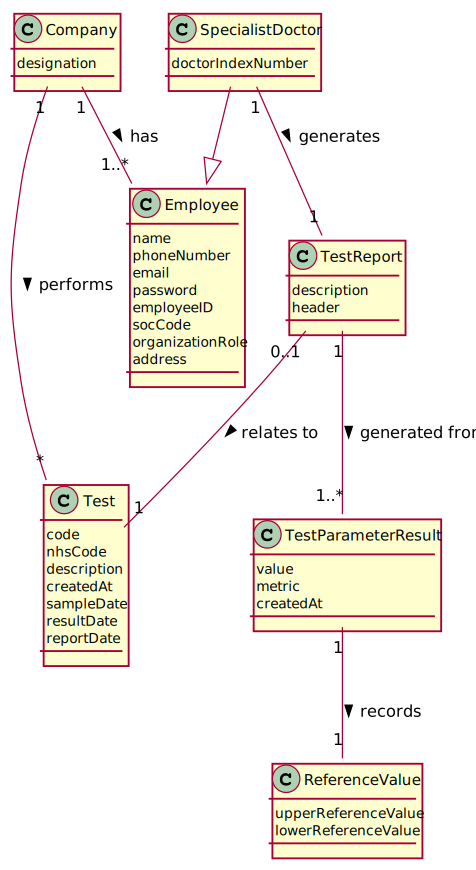

# US 14 - Make Diagnosis And Write Report

## 1. Requirements Engineering

*In this section, it is suggested to capture the requirement description and specifications as provided by the client as well as any further clarification on it. It is also suggested capturing the requirement's acceptance criteria and existing dependencies to other requirements. At last, identify the involved input and output data and depicted an Actor-System interaction in order to fulfill the requirement.*

### 1.1. User Story Description

*As a **Specialist Doctor**, I intend to make the Diagnosis and write a Report for a given test.*

### 1.2. Customer Specifications and Clarifications 

> **Question:** Is there a limit of characters for the report and the diagnosis that will be made by the Specialist Doctor?  
  **Answer:** : Yes, at most 400 words.

> **Question:** Regarding the tests that the Specialist Doctor can write a report about. Should the SD chose from a list of tests?   
  **Answer:** The system shows all tests ready (that have completed all the previous steps) to make the diagnosys and the Specialist Doctor selects one test. Then, the Specialist Doctor writes the report for the selected test. 

> **Question:** What characterizes a diagnosis? What it needs to have in it to be a valid diagnosis?  
  **Answer:** The report contains the diagnosis. The report is free text and should have no more than 400 words. 

> **Question:** How will the specialist doctor's report be delivered to the client? Through an email per example? If it is the case how will the email be delivered? Through an email API or written to a file?  
  **Answer:** Where did you read that the client receives the results? From the Project Description: " [The Client] must access the application to view those results".

> **Question:** Once the specialist doctor decides to write the report for a given test, should the results of the chemical analysis and the reference values be presented on the screen? If not, how should the specialist doctor access the data related to the diagnosis he needs to make?  
  **Answer:** After selecting a test (to make the diagnosis/report) the results of the chemical analysis and the reference values should be presented on the screen. Then the Specialist Doctor should write the report.

> **Question:** While in the "Make a diagnosis and write a report" option of the main menu, should the specialist doctor be able to make a diagnosis and write a report for more than one test? Or does he need to exit and enter the "Make a diagnosis and write a report" option every time he wants to make a new diagnosis and write a new report?  
  **Answer:** After writing a report the SD can choose to write other reports without leaving the use case.

> **Question:** Although it was not asked for, should we order the list of tests to be displayed by date of chemical analysis older to newer?  
  **Answer:** Sorting is not required in this sprint. 

> **Question:** What kind of validation should the external module do? Should it show the test reference values next to the test parameter results for the Specialist Doctor to validate it by himself? Or should it show on the console that the values of the test parameter results are valid, doing everything automatically?  
  **Answer:** The system should "show the test reference values next to the test parameter results".

### 1.3. Acceptance Criteria

- **AC1:** The Test Report cannot have more than four hundred words.

### 1.4. Found out Dependencies

* **US03 Register Client**: This is a dependency, because for a Specialist Doctor to do a Diagnosis and a Report, there needs to be, at least, a Client to make a test on.  
* **US07 Register New Employee**: This is a dependency, because there needs to be at least one Specialist Doctor registered to the Application in order to do a report.  
* **US12 Record Results**: This is a dependency, because for a Specialist Doctor to do a Diagnosis and a Report, there needs to be, at least, a Test that has its results recorded.
    
### 1.5 Input and Output Data

**Input Data:** 

- *Typed Data*: Text/Body of the Test Report.
- *Selected Data:* Test (to do a Report on, through the representative index).
    
**Output Data:**

- List of the Tests without a Report (for the Specialist Doctor to select a Test to do a Report on);
- The Result(s) of the selected Test (for the Specialist Doctor to be able to write the Report).
- The written Test Report (for the Specialist Doctor to confirm the data).
- Confirmation questions (for example, for the Specialist Doctor to confirm the data or the selected test).

### 1.6. System Sequence Diagram (SSD)
*Insert here a SSD depicting the envisioned Actor-System interactions and throughout which data is inputted and outputted to fulfill the requirement. All interactions must be numbered.*

### 1.7 Other Relevant Remarks

This User Story will often happen, but it will only start to be done, when there is at least one Specialist Doctor in the System and when there has been a test with its results recorded.

## 2. OO Analysis

### 2.1. Relevant Domain Model Excerpt
*In this section, it is suggested to present an excerpt of the domain model that is seen as relevant to fulfill this requirement.* 

### 2.2. Other Remarks

Use this section to capture some additional notes/remarks that must be taken into consideration into the design activity. In some case, it might be useful to add other analysis artifacts (e.g. activity or state diagrams).    

The Client, through the forum where the Client Requirements and Specifications where made, clarified that the Diagnosis was not separated from the Report, being part of the Report ("The report contains the diagnosis.", for more information please check the Client Requirements section).

## 3. Design - User Story Realization

### 3.1. Rationale

| Interaction ID | Question: Which class is responsible for... | Answer  | Justification (with patterns)  |
|:-------------  |:--------------------- |:------------|:---------------------------- |
| Step 1: Asks to write a Report/Diagnosis about a Test Result             | ... interacting with the actor?                        | WriteReportUI         | **Pure Fabrication:** there is no reason to assign this responsibility to any existing class in the Domain Model. |
|                                                                          | ... coordinating the User Story?                       | WriteReportController | **Controller** |
|                                                                          | ... instantiating a new Test Report?                   | TestStore             | Responsible for creating and storing all the Test Reports. |
| Step 2: Shows list of Tests with Result                                  | ... showing the List of Tests with Results?            | WriteReportUI         | **IE:** Is responsible for all user interactions. |
|                                                                          | ... getting the List of Tests with Results?            | TestStore             | **IE:** Knows all of its data. |
|                                                                          | ... checking if a Test needs a Report?                 | TestStore             | **IE:** Knows all of its data. |
|                                                                          | ... getting the Store?                                 | Company               | Responsible for storing all the Stores used by the application. |
|                                                                          | ... making a copy of the List to send to the UI?       | TestMapper            | Capable of making Data Transfer Objects. |
| Step 3: Chooses one Test (with Result) to write a Report/Diagnosis about | ... permitting the User to select the Test?            | WriteReportUI         | **IE:** Is responsible for all user interactions. |
| Step 4: Asks for confirmation of the selected Test                       | ... asking for confirmation of the selected Test?      | WriteReportUI         | **IE:** Is responsible for all user interactions. |
| Step 5: Confirms the Test to the report on                               | ... permitting the User to give confirmation?          | WriteReportUI         | **IE:** Is responsible for all user interactions. |
|                                                                          | ... getting the selected Test to do a Report on?       | TestStore             | **IE:** Knows all the Tests and knows all of its data. |
|                                                                          | ... getting the User that is logged in?                | AuthFacade            | **IE:** Knows all the data relative to the Users. |
|                                                                          | ... getting the Specialist Doctor's information?       | UserSession           | **IE:** Knows the User that is logged in and its information. |
|                                                                          | ... having the information of the Specialist Doctor?   | User                  | **IE:** Knows its own data. |
| Step 6: Shows the results of the Test and asks for data (text)           | ... asking the data?                                   | WriteReportUI         | **IE:** Is responsible for all user interactions. |
|                                                                          | ... getting the results of the chosen Test?            | Test                  | **IE:** Owns its data. |
|                                                                          | ... showing the results of the chosen Test?            | WriteReportUI         | **IE:** Is responsible for all user interactions. |
| Step 7: Types the requested data                                         | ... saving the data?                                   | TestStore             | **IE:** Knows all the data. |
|                                                                          | ... allowing the data to be typed?                     | WriteReportUI         | **IE:** Is responsible for all the user interactions. |
| Step 8: Asks for confirmation of the typed data                          | ... asking confirmation of the given data?             | WriteReportUI         | **IE:** Is responsible for all user interactions. |
| Step 9: Confirms the typed data                                          | ... validating all the data (Local Validation)?        | TestReport            | **IE:** Owns its data. |
|                                                                          | ... validating all the data (Global Validation)?       | TestStore             | **IE:** Knows all the TestReport objects. |
|                                                                          | ... associating the created Test Report to the Test?   | TestStore             | **IE:** Records/Has all the TestReport and Test objects. |
|                                                                          | ... generating the date for the Test Report?           | Utils                 | **Pure Fabrication**: Has the necessary information to generate the Date. |
| Step 10: Informs of operation success                                    | ... informing of the operation success?                | WriteReportUI         | **IE:** Is responsible for all the user interactions. |
| Step 11: Asks if the Specialist Doctor wants to write another\n Report   | ... asking the Specialist Doctor?                      | WriteReportUI         | **IE:** Is responsible for all the user interactions. |
| Step 12: Decides if he wants to write another Report                     | ... allowing the Specialist Doctor to make his/her decision? | WriteReportUI   | **IE:** Is responsible for all the user interactions. |
| Step 13: Confirms the Specialist Doctor's decision                       | ... proceeding according to the made decision?         | WriteReportUI         | **IE:** Is responsible for all the user interactions. |

### Systematization ##

According to the taken rationale, the conceptual classes promoted to software classes are:

* Test
* TestReport
* Company

Other software classes (i.e. Pure Fabrication) identified:

* WriteReportUI
* WriteReportController
* TestStore
* TestMapper
* Utils
* AuthFacade
* UserSession
* User

## 3.2. Sequence Diagram (SD)

*In this section, it is suggested to present an UML dynamic view stating the sequence of domain related software objects' interactions that allows to fulfill the requirement.* 

Sequence Diagram for the User Story 14: Make Diagnosis and Write Report:  

Sequence Diagram that represents how the Test Store is created:    

## 3.3. Class Diagram (CD)

*In this section, it is suggested to present an UML static view representing the main domain related software classes that are involved in fulfilling the requirement as well as and their relations, attributes and methods.*

# 4. Tests 
*In this section, it is suggested to systematize how the tests were designed to allow a correct measurement of requirements fulfilling.* 

**_DO NOT COPY ALL DEVELOPED TESTS HERE_**

*It is also recommended organizing this content by subsections.* 

# 5. Construction (Implementation)

*In this section, it is suggested to provide, if necessary, some evidence that the construction/implementation is in accordance with the previously carried out design. Furthermore, it is recommended to mention/describe the existence of other relevant (e.g. configuration) files and highlight relevant commits.*

*It is also recommended organizing this content by subsections.* 

# 6. Integration and Demo 

*In this section, it is suggested to describe the efforts made to integrate this functionality with the other features of the system.*

For the Specialist Doctor to do a Report, there must be Tests waiting for one.  
So, this functionality, needs at least a Test with Results, so if the other functionalities (like, Registering a Test or Making a Sample or Recording the Results), have not happened, the System will warn the Specialist Doctor that there are no Tests to do a Report on.    
In case, that is not verified, the System will let the Specialist Doctor select a Test to do the Report on, and after that, the Specialist Doctor will be able to write the Report.    
If the Report is valid, the System will print a line to the console confirming that the Test Report was valid and that it was saved.   
Else, the System will warn the Specialist Doctor that there was an Error.  

# 7. Observations

*In this section, it is suggested to present a critical perspective on the developed work, pointing, for example, to other alternatives and or future related work.*  

