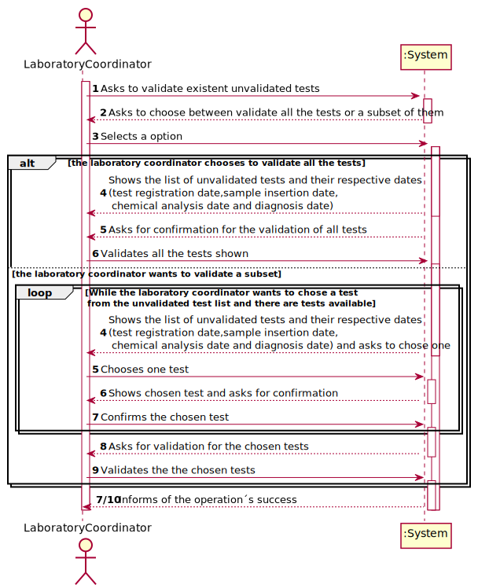
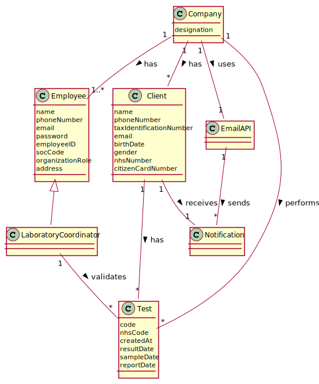
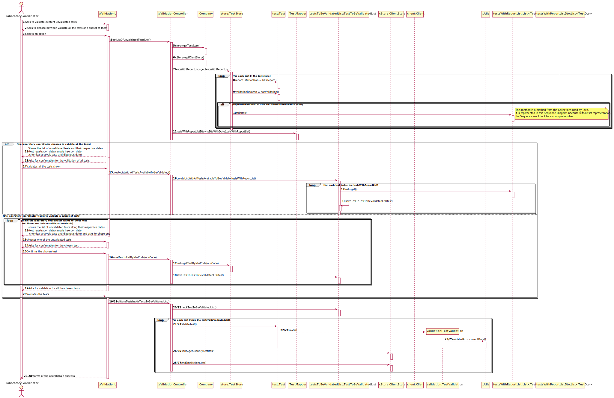
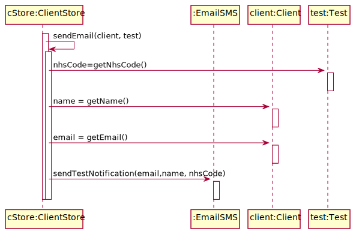
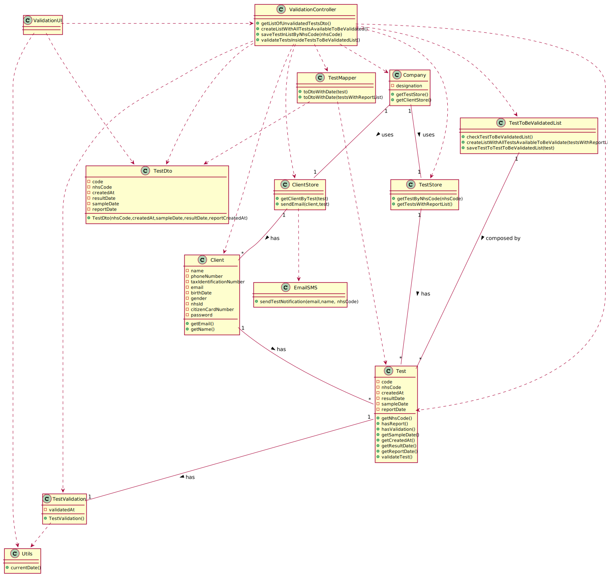

# US 15 - Validate a Test

## 1. Requirements Engineering

*In this section, it is suggested to capture the requirement description and specifications as provided by the client as well as any further clarification on it. It is also suggested to capture the requirements acceptance criteria and existing dependencies to other requirements. At last, identfy the involved input and output data and depicted an Actor-System interaction in order to fulfill the requirement.*

### 1.1. User Story Description

* As a laboratory coordinator, I want to validate the work done by the clinical chemistry
technologist and specialist doctor. 

### 1.2. Customer Specifications and Clarifications 

####From the specifications document:

>After the specialist doctor has completed the diagnosis, the results of the clinical analyses and the
report become available in the system and must be validated by the laboratory coordinator. To
validate the work done, the laboratory coordinator checks the chemical test/result and associated
diagnosis made and confirms that everything was done correctly. Once the laboratory coordinator
confirms that everything was done correctly, the client receives a notification alerting that the
results are already available in the central application and informing that he/she must access the
application to view those results

#### From the Client Specification:

>* **Question**:Regarding the process of validating a certain test/result, what validation states should be considered by the laboratory coordinator?  
    For example, can "Valid" or "Invalid" be accepted as a confirmation for the chemical test/result and its diagnosis?  
    **Answer**:: Only Valid state. The system shows all tests ready to validate (tests that already have the test registration date, the chemical analysis date and the diagnosis date registered in the system), and the laboratory coordinator selects one or more tests to mark as validated. 

> * **Question**: Regarding US 15, what information does the laboratory coordinator needs to be able to validate a test? We got from the description that it's supposed to show all dates. Should the system provide any more information?  
    **Answer**: Only the dates.
    Moreover, the system should record the validation date.

> * **Question**: How should the laboratory coordinator choose the test to operate on, from a list of all the tests with a result and report or by inputting the code unique to a specific test?  
     **Answer**: From a list of all tests that have a test registration date, a chemical analysis date, and a diagnosis date.

> * **Question**: Does the notification sent to client informing them that they have their results on the central application get sent automatically after the laboratory coordinator confirms the clinical chemistry technologist and specialist doctor's work?  
   **Answer**: From the Project Description: "Once the laboratory coordinator confirms that everything was done correctly, the client receives a notification alerting that the results are already available in the central application and informing that he/she must access the application to view those results."

> * **Question**: After validation do we need to have the time and date of the validation?  
   **Answer**: Yes, the system should record the date (DD/MM/YYYY) and time (HH:MM) when the validation was made.  
   Moreover, in this US, when the system shows to the laboratory coordinator all the dates (test registration date, chemical analysis date and diagnosis date), the system should show the date (DD/MM/YYYY), and the time (HH:MM).  

*Insert here any related specification and/or clarification provided by the client together with **your interpretation**. When possible, provide a link to such specifications/clarifications.*

### 1.3. Acceptance Criteria

*Insert here the client acceptance criteria.*

* **AC1:** : The system should not show client personal information in the validation process .
* **AC2:** : The system should show all dates associated with a test in the validation process (test registration date,sample insertion date, chemical analysis date and diagnosis date)
* **AC3** : The laboratory coordinator can only validate the test not having the option to invalidate
* **AC4** : All tests to be validated should be selected from a list of test ready to be validated(tests with a test registration date, chemical analysis date and diagnosis date)
* **AC5** : In the end of the validation process the client should receive an email notification,warning of the availability of the results
* **AC6** : In the end of the validation process  the system should record the validation date in the test being validated
* **AC7**: The laboratory coordinator should have the possibility of validation more than one test at time
* **AC8**: The dates should be according to the following format,the date (DD/MM/YYYY) and time (HH:MM)

### 1.4. Found out Dependencies

*Identify here any found out dependency to other US and/or requirements.*
* **US03 Register Client**: This is a dependency, because for a Laboratory coordinator to Validate a test, there needs to be, at least, a Client to make a test on.
* **US07 Register New Employee**: This is a dependency, because there needs to be at least one Laboratory coordinator registered to the Application in order to validate a test.
* **US14 Write Report**: This is a dependency, because for a Laboratory coordinator to validate a test, there needs to be, at least, a Test that has its report recorded.

### 1.5 Input and Output Data

*Identity here the data to be inputted by the system actor as well as the output data that the system have/needs to present in order to properly support the actor actions. Regarding the inputted data, it is suggested to distinguish between typed data and selected data (e.g. from a list)*

**Input Data:**

* Typed data:
    * Validation of the chosen tests(s/n)
    
* Selected data:  
  
    * Chosen option(Validate all, or a subset of tests)
    * Chosen unvalidated tests
    

**Output Data:**

* Option between validate all, or a subset of tests
* List of existing tests available to be validated
* Dates associated with a test (test registration date,sample insertion date,chemical analysis date and diagnosis date)
* (In)Success of the operation

### 1.6. System Sequence Diagram (SSD)

*Insert here a SSD depicting the envisioned Actor-System interactions and throughout which data is inputted and outputted to fulfill the requirement. All interactions must be numbered.*

### 1.7 Other Relevant Remarks

*Use this section to capture other relevant information that is related with this US such as (i) special requirements ; (ii) data and/or technology variations; (iii) how often this US is held.* 
* The laboratory coordinator only has the option to validate.

## 2. OO Analysis

### 2.1. Relevant Domain Model Excerpt 
*In this section, it is suggested to present an excerpt of the domain model that is seen as relevant to fulfill this requirement.* 

### 2.2. Other Remarks

*Use this section to capture some aditional notes/remarks that must be taken into consideration into the design activity. In some case, it might be usefull to add other analysis artifacts (e.g. activity or state diagrams).* 

## 3. Design - User Story Realization 

### 3.1. Rationale

**The rationale grounds on the SSD interactions and the identified input/output data.**

| Interaction ID | Question: Which class is responsible for... | Answer  | Justification (with patterns)  |
|:-------------  |:--------------------- |:------------|:---------------------------- |
| Step 1  		 |	... interacting with the actor? | ValidationUI   |  **Pure Fabrication**: there is no reason to assign this responsibility to any existing class in the Domain Model.  |
| 			  	 |	... coordinating the US? | ValidationController | **Controller**|
|                                    | ... knowing the Stores? | Company |**IE:** Company knows the all the stores to which it is delegating some tasks |
| Step 2  		 ||||
| Step 3  		 ||||
| Step 4           | ...knowing the unvalidated tests?          | TestStore | **IE:**:TestStore knows all the tests |
|                |  ...knowing the dates belonging to a given test? | Test| **IE:**:Test knows all its information   |    
| Step 5  | | | |
|                                            
| Step 6		 |  ... knowing which tests to validate? | TestToBeValidatedList|  **IE:**: TestToBeValidatedList possesses a list with all the tests to be validated |
|                | ...validating a test?          | TestValidation | **IE:**:TestValidation knows the process required to successfully validate a test |
|                           |  ...generating the current date? |Utils | **Pure Fabrication**: has the necessary information to generate the current Date. |
                      | | 	... sending email? | EmailSMS | **IE** and **Pure Fabrication:** has all the required information and means to send the email (IE). However, to avoid code duplication (cf.US3,US7) this responsibility might be assign to a common and shared artificial class, specialized in this task.|
| Step 4	   | ...knowing all the  unvalidated tests?   | TestStore | **IE:**:TestStore knows all the tests |
|              |   ...knowing the dates belonging to a given test? | Test| **IE:**:Test knows all its information   |                 |              
| Step 5 | | | |
| Step 6      | ...Asking for confirmation?| ValidationUI  | **IE:** is responsible for user interactions.  |
| Step 7      | ...knowing which test was chosen?           |TestStore | **IE:** TestStore knows all the tests             |
|Step 8 ||||
|Step 9     |    ... knowing which tests to validate? | TestToBeValidatedList| **IE:**: TestToBeValidatedList possesses a list with all the tests to be validated |
|                           |... performing the validation of the test? | TestValidation | **IE:**: TestToBeValidatedList possesses a list with all the tests to be validated|
|             |  ...generating the current date? |Utils |**Pure Fabrication**: has the necessary information to generate the current Date. |
|             | 	... sending email? | EmailSMS | **IE** and **Pure Fabrication:** has all the required information and means to send the email (IE). However, to avoid code duplication (cf.US3,US7) this responsibility might be assign to a common and shared artificial class, specialized in this task.| 
| Step 7/10      | ... informing operation success?| ValidationUI  | **IE:** is responsible for user interactions.  | 
### Systematization ##

According to the taken rationale, the conceptual classes promoted to software classes are: 

 * Company
 * Test

Other software classes (i.e. Pure Fabrication) identified:   

 * ValidationUI  
 * ValidationController
 * TestStore
 * TestToBeValidatedList
* **EmailSMS**
* Utils
* TestValidation

## 3.2. Sequence Diagram (SD)

*In this section, it is suggested to present an UML dynamic view stating the sequence of domain related software objects' interactions that allows to fulfill the requirement.* 

## 3.3. Class Diagram (CD)

*In this section, it is suggested to present an UML static view representing the main domain related software classes that are involved in fulfilling the requirement as well as and their relations, attributes and methods.*

# 4. Tests 
*In this section, it is suggested to systematize how the tests were designed to allow a correct measurement of requirements fulfilling.* 

**_DO NOT COPY ALL DEVELOPED TESTS HERE_**

**Test 1:** Check that it is not possible to create an instance of the Example class with null values. 

	@Test(expected = IllegalArgumentException.class)
		public void ensureNullIsNotAllowed() {
		Exemplo instance = new Exemplo(null, null);
	}

*It is also recommended to organize this content by subsections.* 

# 5. Construction (Implementation)

*In this section, it is suggested to provide, if necessary, some evidence that the construction/implementation is in accordance with the previously carried out design. Furthermore, it is recommeded to mention/describe the existence of other relevant (e.g. configuration) files and highlight relevant commits.*

*It is also recommended to organize this content by subsections.* 

# 6. Integration and Demo 

*In this section, it is suggested to describe the efforts made to integrate this functionality with the other features of the system.*

The system verifies if the other USs where conducted before allowing the test to be shown for the laboratory coordinator
# 7. Observations

*In this section, it is suggested to present a critical perspective on the developed work, pointing, for example, to other alternatives and or future related work.*

As requested by the SW Client the e-mail are not being sent. Instead, email are being written to a file with the name emailAndSMSMessages.txt.

